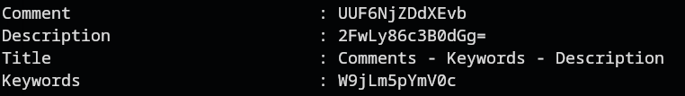
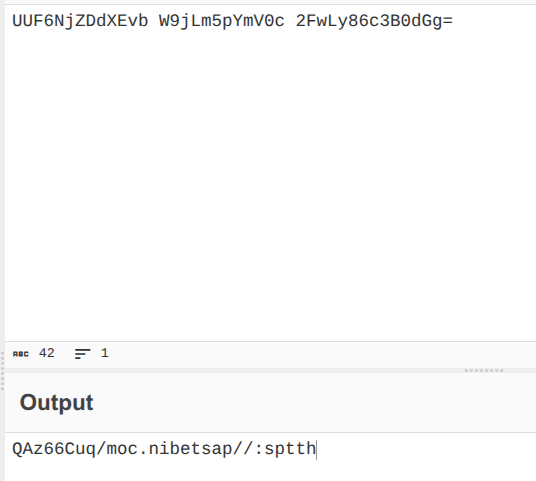
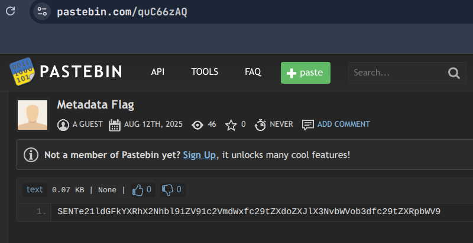
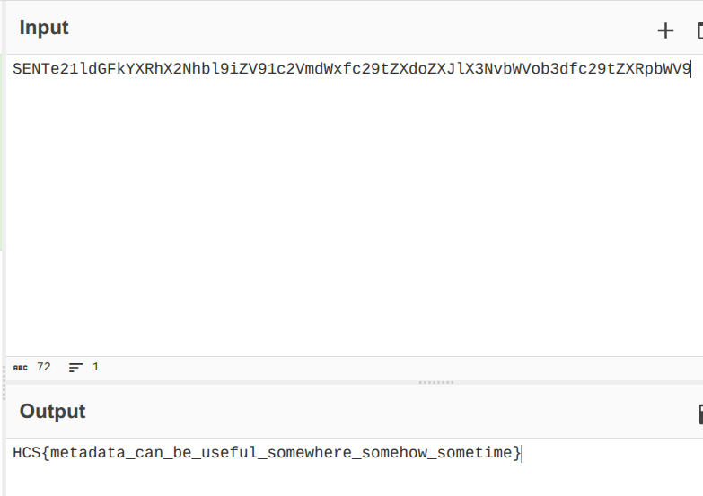

# Atadatem
### Description: look there are data that seperated!! you should combine them!

We are given a .png file called ```hcs.png```.

Now, looking at the challenge title which when reversed is "metadatA", and the description which says that there are "separated" data, and we should combine them, my first instinct was to pull out exiftool on the image.

Running ```exiftool hcs.png``` gives us these interesting bits:



Comment, Description, and Keywords seems to be Base64 encoded strings. And Title shows us how to properly combine them with the right order. 

So i went ahead to CyberChef and pasted the Base64's in the order defined by Title:



It gave us 
```
QAz66Cuq/moc.nibetsap//:sptth
```

This may look like nonsense, but the challenge title is reversed, so when we reverse this string, we get a pastebin link:

```https://pastebin.com/quC66zAQ```

Visiting the pastebin link gave us another Base64 string:



Decoding it yields the flag:



Flag: ```HCS{metadata_can_be_useful_somewhere_somehow_sometime}```