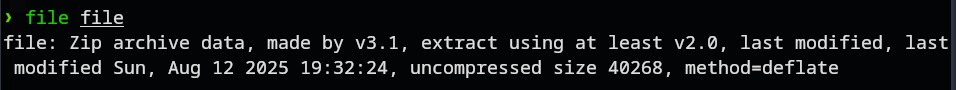
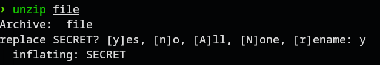
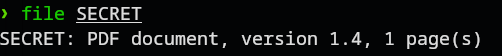
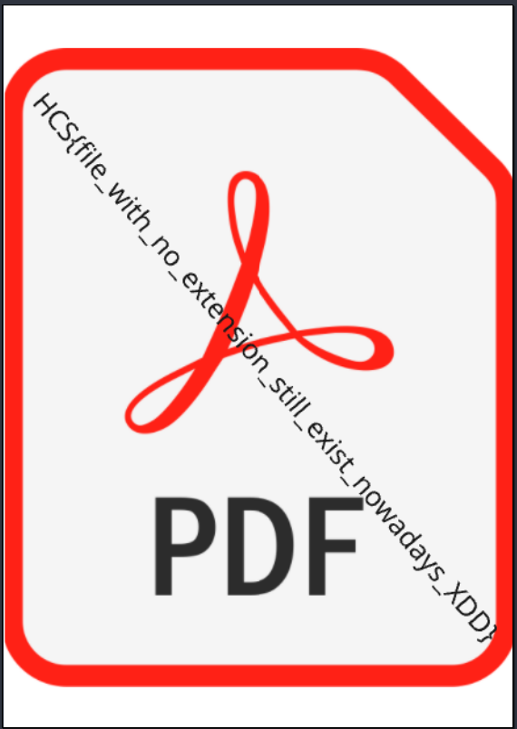

# Blind File
### Description: Ohh noooo! what is thisss??? can you help me?!?!

We are given a file with no extension, just called file.

Running the command ```file``` on file lets us know what it truly is:



It is a zip file, so unzipping it give us another file:



Ignre replace SECRET. this was done post-competition.



Running file on SECRET tells us it's a PDF document. so i pulled up Okular on it:



Flag: ```HCS{file_with_no_extension_still_exist_nowadays_XDD}```