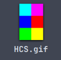
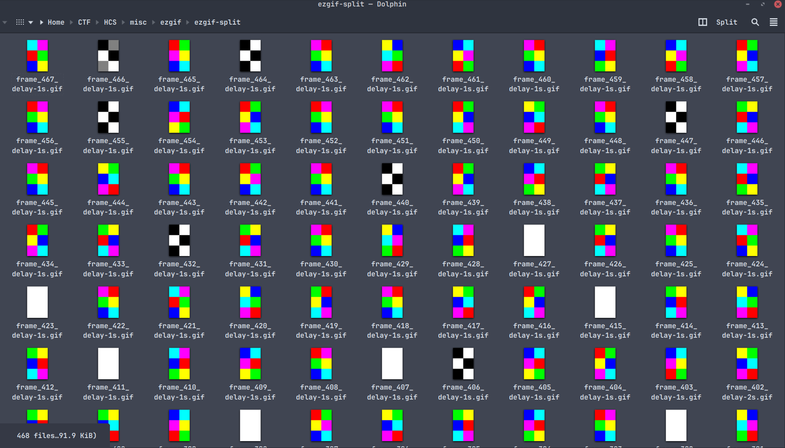
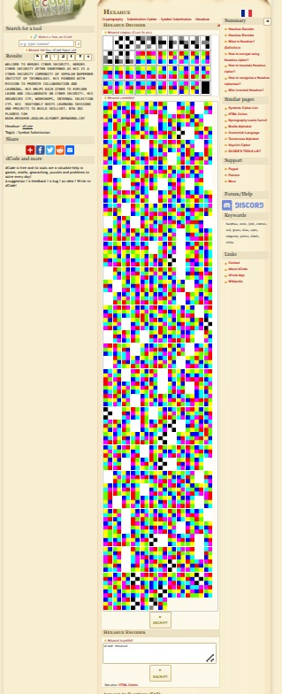

# Hexahue Bergerak
### Description: Selamat datang di Hexahue Bergerak!

### Kalian akan berhadapan dengan Hexahue, sistem penulisan yang menyusun enam blok warna dalam kisi 2×3 untuk mewakili satu karakter.

### Tapi challenge ini agak berbeda. Teks disembunyikan di dalam GIF animasi, di mana setiap frame merepresentasikan satu karakter Hexahue. Menerjemahkan satu per satu frame secara manual bakal makan waktu.

### Note :

### Masukkan teks yang kalian dapatkan ke dalam kurung kurawal dari HCS{...}

### Flag terdiri dari huruf kecil, titik, dan angka.

### Format flag : HCS\{[a-z0-9\.]+\}

### Di perhatikan lagi isi pesan yang kalian sudah dapatkan dan jangan lupa di format sesuai aturan diatas

We are given a .gif file ```HCS.gif```:



The gif changes the hexahue color every second, so trying to decode it right now is impossible and pointless. First, we must separate the gif frame-by-frame. To do that, we use ```ezgif.com/split```

I uploaded the gif, and downloaded the separated frame-by-frame zip, and extracted it:



Now i know, the intended way to solve this is by using a python script and mapping each 2x3 box to a unique character, using the Hexahue Cipher standard.

But i cannot write the script because skill issue and prompting ChatGPT and Claude 8 times doesn't seem to produce anything workable despite changing the wording everytime.

And it is 9PM the first day that i begin to work on this, and i was stuck on the other challenges, so i said screw it and, like a freaking maniac, decoded each and every single frame manually by clicking the right 2x3 at ```decode.fr```:



It **only** took until 1AM.

Anyway, the decoded text is:
```
WELCOME TO HEROES CYBER SECURITY. HEROES CYBER SECURITY OFTEN SHORTENED AS HCS IS A CYBER SECURITY COMMUNITY OF SEPULUH NOPEMBER INSTITUT OF TECHNOLOGY. HCS FOUNDED WITH MISSION TO PROMOTE COLLABORATION AND LEARNING. HCS HELPS EACH OTHER TO EXPLORE LEARN AND COLLABORATE ON CYBER SECURITY. HCS ORGANIZES CTF, WORKSHOPS, INTERNAL SELECTION CTF. HCS  ROUTINELY HOSTS LEARNING SESSIONS AND PROJECTS TO BUILD SKILLSET. BTW INI FLAGNYA YAH WOAH.HEXAHUE.ADALAH.ALFABET.BERWARNA.C0Y
```

The flag seems to be ```WOAH.HEXAHUE.ADALAH.ALFABET.BERWARNA.C0Y```, i told ChatGPT to make all the capitals lowercase as per the submission rule and append HCS{} to encase it to a flag.

Flag: ```HCS{woah.hexahue.adalah.alfabet.berwarna.c0y}```