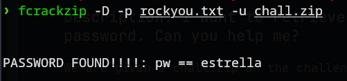
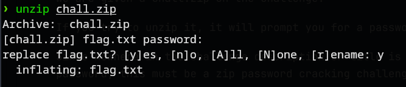
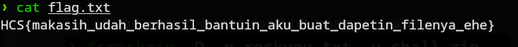

# I Forgot Something
### Description: I want to retrieve my files but I forgot the password. Can you help me?

We are given a chall.zip on the challenge.

If you try to unzip it, it will prompt you for a password.

Since nowhere in the challenge description or title is a hint for the password, this must be a zip password cracking challenge.

To begin, i downloaded rockyou.txt from ```https://github.com/zacheller/rockyou```

Afterwards, using ```fcrackzip``` (https://archlinux.org/packages/extra/x86_64/fcrackzip/) if you are using Arch like me, i entered the following command into the terminal:

```
❯ fcrackzip -D -p rockyou.txt -u chall.zip
```

One of the word from the wordlist was the password:


Afterwards, i unzipped it using ```unzip chall.zip``` and entered the password when prompted:


(Ignore replace flag.txt, this was done post-competition).

Opening the flag.txt using cat revealed the flag:


Flag: ```HCS{makasih_udah_berhasil_bantuin_aku_buat_dapetin_filenya_ehe}```
