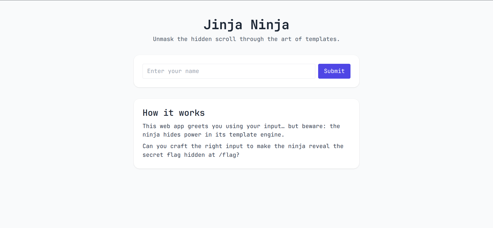
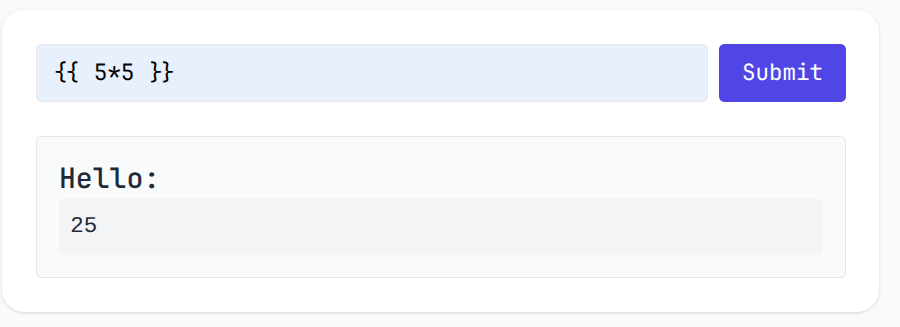
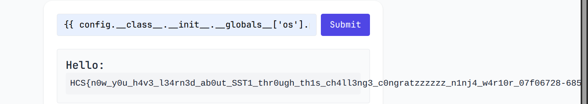

# Jinja Ninja
### Description: WTF is a JINJA? Aint it supposed to be NINJA RAHHHHHHHH

We are given a link to a website:



This appears to be a Server-Side Template Injection (SSTI) challenge using the Jinja2 template engine.

We can try to see if template injection works by inputting ```{{ 5*5 }}```:



After indeed confirming it works, we can get the flag by using Config.

```
{{ config.__class__.__init__.__globals__['os'].popen('cat /flag').read() }}
```

In Flask applications (which commonly use Jinja2), config is a global object automatically available in templates which contains the application's configuration settings.

```config.__class__``` Gets the class type of the config object
that will give you access to the class itself, not just the instance

```config.__class__.__init__``` Accesses the constructor method (__init__) of the config class. Since every Python class has an __init__ method. This method is a function object with useful attributes

```config.__class__.__init__.__globals__``` ```__globals__```is a special attribute of function objects because it contains the global namespace where the function was defined. This gives us access to all imported modules and variables in that scope

From the global namespace, we access the os module: ``` __globals__['os']```. The os module was imported somewhere in the Flask application. ['os'] uses dictionary-style access to get the module.

```popen('cat /flag')``` os.popen() executes a shell command and returns a file-like object, and ```'cat /flag'``` is the command to read the flag file.

```read()``` Reads the output from the popen command and then returns the contents of /flag as a string, leading us to the flag:



Flag: ```HCS{n0w_y0u_h4v3_l34rn3d_ab0ut_SST1_thr0ugh_th1s_ch4ll3ng3_c0ngratzzzzzz_n1nj4_w4r10r_07f06728-6856-401b-8389-cefe370f0113}```
