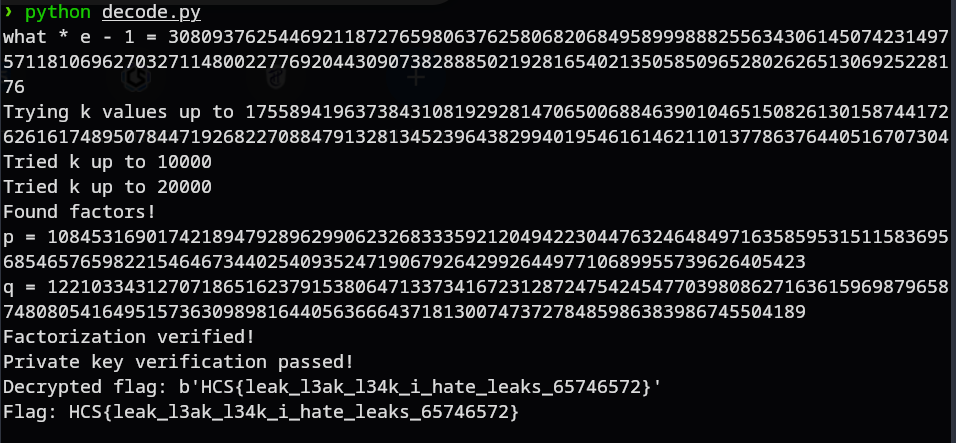

# L3AK
### Description: what is what?

We are given a zip file ```chall.zip```.

Unzipping it gives us ```chall.py``` and ```output.txt```.

chall.py:
```
from Crypto.Util.number import *
with open('flag.txt') as f:
    flag = f.read().strip()

p = getPrime(512)
q = getPrime(512)
n = p * q
phi = (p - 1) * (q - 1)

e = 65537
d = inverse(e, phi)
what = d % (p - 1)

ct = pow(bytes_to_long(flag.encode()), e, n)
with open('output.txt', 'w') as f:
    f.write(f'n = {n}\n')
    f.write(f'ct = {ct}\n')
    f.write(f'what = {what}\n')%                                                      
```
output.txt:
```
n = 132424945097525850654214822436841749617596013766516589461846053019923921509419349878188173267137393388564369574894943951802964034938666342594121858359017467945336230806773103437033058400722533249173019431218833060574032187854004778243330232248639993250668984287478087484530899867973181768171106834615858816947
ct = 8690256152525015206584791844752543379719744787620368046544606811870676380837374553817755653019413372016870108768104936568432345008226950086769230094097164464486596908050930851678115904352532562944170575365724833300330295692157262447360439786705110831106538310141401194897207768598781335529794463310318530218
what = 4701066001566933468539295457165541117336002410834834617743586840140912396231299819496271034686173752299173098904260222360140687146281504574213995930648721
```

This looks like a RSA Cryptography challenge, where partial leak to the key can lead to total decryption of the encrypted message, in this case the flag.

Based on the source code and output.txt, i drafted a decoder with the help of our lord and saviour LLM for crypto challenges, Claude:

```
from Crypto.Util.number import *
import math

# Given values from the challenge
n = 132424945097525850654214822436841749617596013766516589461846053019923921509419349878188173267137393388564369574894943951802964034938666342594121858359017467945336230806773103437033058400722533249173019431218833060574032187854004778243330232248639993250668984287478087484530899867973181768171106834615858816947
ct = 8690256152525015206584791844752543379719744787620368046544606811870676380837374553817755653019413372016870108768104936568432345008226950086769230094097164464486596908050930851678115904352532562944170575365724833300330295692157262447360439786705110831106538310141401194897207768598781335529794463310318530218
what = 4701066001566933468539295457165541117336002410834834617743586840140912396231299819496271034686173752299173098904260222360140687146281504574213995930648721

e = 65537

def solve_rsa_partial_key():
    """
    Solve RSA when we know d mod (p-1)
    
    We know that:
    - d * e ≡ 1 (mod φ(n))
    - φ(n) = (p-1)(q-1)
    - what = d mod (p-1)
    
    This means d = what + k*(p-1) for some integer k
    
    Since d * e ≡ 1 (mod (p-1)(q-1)), we have:
    (what + k*(p-1)) * e ≡ 1 (mod (p-1)(q-1))
    
    This gives us:
    what * e + k * (p-1) * e ≡ 1 (mod (p-1)(q-1))
    
    Since (p-1) divides (p-1)(q-1), we get:
    what * e ≡ 1 (mod (p-1))
    
    So what should be the modular inverse of e modulo (p-1)
    """
    
    # Try to factor n using the partial information
    # We know that what * e ≡ 1 (mod (p-1))
    # So what * e = 1 + k * (p-1) for some k
    
    # This means (p-1) divides (what * e - 1)
    ke_minus_1 = what * e - 1
    
    print(f"what * e - 1 = {ke_minus_1}")
    
    # Try different values of k to find potential (p-1) values
    # Since d is approximately the same size as φ(n), and what = d mod (p-1),
    # we can estimate the range of k values to try
    
    # φ(n) ≈ n, so d ≈ n/e (roughly)
    # k ≈ d / (p-1) ≈ (n/e) / (p-1)
    # Since p ≈ sqrt(n), we have p-1 ≈ sqrt(n)
    # So k ≈ (n/e) / sqrt(n) = sqrt(n)/e
    
    estimated_k_max = int(math.sqrt(n) // e) + 1000  # Add some buffer
    
    print(f"Trying k values up to {estimated_k_max}")
    
    for k in range(1, estimated_k_max):
        if ke_minus_1 % k == 0:
            potential_p_minus_1 = ke_minus_1 // k
            potential_p = potential_p_minus_1 + 1
            
            # Check if this p divides n
            if n % potential_p == 0:
                p = potential_p
                q = n // p
                
                print(f"Found factors!")
                print(f"p = {p}")
                print(f"q = {q}")
                
                # Verify the factorization
                if p * q == n:
                    print("Factorization verified!")
                    
                    # Calculate the private key
                    phi = (p - 1) * (q - 1)
                    d = inverse(e, phi)
                    
                    # Verify that what = d mod (p-1)
                    if d % (p - 1) == what:
                        print("Private key verification passed!")
                        
                        # Decrypt the message
                        pt_long = pow(ct, d, n)
                        flag = long_to_bytes(pt_long)
                        
                        print(f"Decrypted flag: {flag}")
                        return flag.decode()
                    else:
                        print(f"Verification failed: d mod (p-1) = {d % (p-1)}, expected {what}")
                        continue
        
        if k % 10000 == 0:
            print(f"Tried k up to {k}")
    
    print("No solution found in the given range")
    return None

# Run the solver
result = solve_rsa_partial_key()
if result:
    print(f"Flag: {result}")
else:
    print("Failed to solve the challenge")
```
Running the decoder gives us the flag:



Flag: ```HCS{leak_l3ak_l34k_i_hate_leaks_65746572}```