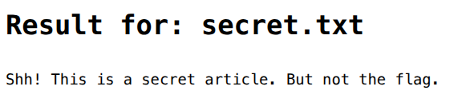

# LeFI Gimang
### Description: LeFi is an attack technique in which attackers trick a web application into either running or exposing files on a web server. Connect with http ya

Based on the challenge name and the obvious description, this is an LFI attack problem.

We are given a link to connect using http.

Here is the initial webpage: 


Opening welcome.txt:


Seems like flavor text, nothing too glaring.

Opening tips.txt:


Ok this tip seems to be promising, will keep that in mind.

Opening secret.txt:



Of course it won't be that easy to get the flag.

Anyway, let's start doing LFI. Based on the hint on tips.txt, we should append full paths to the end of the ?query= on the website link.

If we assume the flag is stored in a .txt called hcs.txt, intersec.txt or flag.txt, we can append 
```
../../../../../../../../<filename>.txt
```

Let's start with hcs.txt since the competition is "HCS Intersec":


Okay, maybe intersec.txt:


Yeah no, maybe flag.txt then:


Hell yeah we got the flag.

Flag: ```HCS{LFI_buT_n0w_y0u_us1n9_tr4v3r5AL_de013d27-d797-4c3a-b6bc-54be4d6e4d63}```