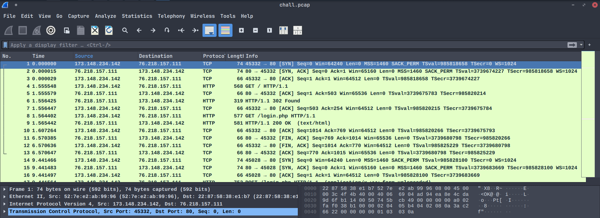
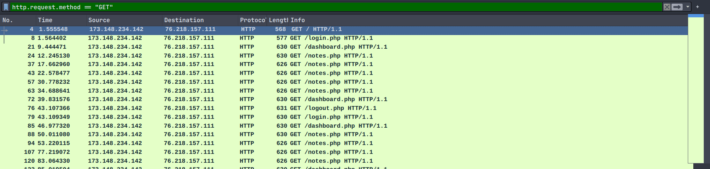
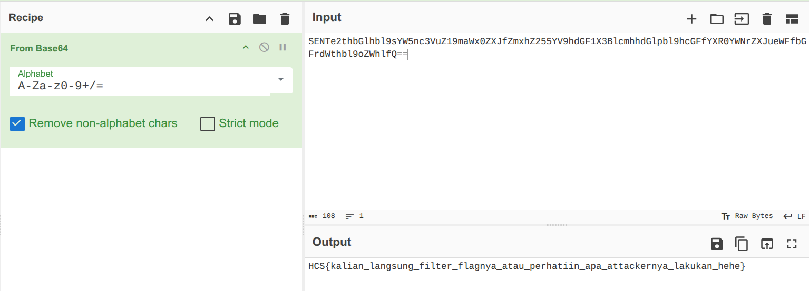

# My Networ(th)k
### Description: Abis capture network website gweh, tentunya gada yang aneh lah ya?

In this challenge, we are given a chall.pcap file.

Let's open it using wireshark and analyze it.



As you can see, this is a bunch of GET and POST request between a user and a server.

Following the HTTP stream of the first instance of notes.php packet, yields these:

```
POST /login.php HTTP/1.1
Host: localhost:8080
User-Agent: Mozilla/5.0 (X11; Linux x86_64; rv:141.0) Gecko/20100101 Firefox/141.0
Accept: text/html,application/xhtml+xml,application/xml;q=0.9,*/*;q=0.8
Accept-Language: en-US,en;q=0.5
Accept-Encoding: gzip, deflate, br, zstd
Content-Type: application/x-www-form-urlencoded
Content-Length: 25
Origin: http://localhost:8080
Sec-GPC: 1
Connection: keep-alive
Referer: http://localhost:8080/login.php
Cookie: PHPSESSID=8a1ac9240423fac9562123792a0b8684
Upgrade-Insecure-Requests: 1
Sec-Fetch-Dest: document
Sec-Fetch-Mode: navigate
Sec-Fetch-Site: same-origin
Sec-Fetch-User: ?1
Priority: u=0, i

username=cek&password=cek
HTTP/1.1 302 Found
Date: Fri, 08 Aug 2025 16:07:56 GMT
Server: Apache/2.4.62 (Debian)
X-Powered-By: PHP/8.1.33
Expires: Thu, 19 Nov 1981 08:52:00 GMT
Cache-Control: no-store, no-cache, must-revalidate
Pragma: no-cache
Location: dashboard.php
Content-Length: 0
Keep-Alive: timeout=5, max=100
Connection: Keep-Alive
Content-Type: text/html; charset=UTF-8


GET /dashboard.php HTTP/1.1
Host: localhost:8080
User-Agent: Mozilla/5.0 (X11; Linux x86_64; rv:141.0) Gecko/20100101 Firefox/141.0
Accept: text/html,application/xhtml+xml,application/xml;q=0.9,*/*;q=0.8
Accept-Language: en-US,en;q=0.5
Accept-Encoding: gzip, deflate, br, zstd
Referer: http://localhost:8080/login.php
Sec-GPC: 1
Connection: keep-alive
Cookie: PHPSESSID=8a1ac9240423fac9562123792a0b8684
Upgrade-Insecure-Requests: 1
Sec-Fetch-Dest: document
Sec-Fetch-Mode: navigate
Sec-Fetch-Site: same-origin
Sec-Fetch-User: ?1
Priority: u=0, i


HTTP/1.1 200 OK
Date: Fri, 08 Aug 2025 16:07:56 GMT
Server: Apache/2.4.62 (Debian)
X-Powered-By: PHP/8.1.33
Expires: Thu, 19 Nov 1981 08:52:00 GMT
Cache-Control: no-store, no-cache, must-revalidate
Pragma: no-cache
Vary: Accept-Encoding
Content-Encoding: gzip
Content-Length: 166
Keep-Alive: timeout=5, max=99
Connection: Keep-Alive
Content-Type: text/html; charset=UTF-8

<h1>Welcome, cek</h1>
<p>Here are your options:</p>
<p><a href="notes.php">My notes</a></p>
<p><a href="upload.php">Upload</a></p>
<p><a href="logout.php">Logout</a></p>
<p>Also we have a special file, good luck finding it lmao:</p>

GET /notes.php HTTP/1.1
Host: localhost:8080
User-Agent: Mozilla/5.0 (X11; Linux x86_64; rv:141.0) Gecko/20100101 Firefox/141.0
Accept: text/html,application/xhtml+xml,application/xml;q=0.9,*/*;q=0.8
Accept-Language: en-US,en;q=0.5
Accept-Encoding: gzip, deflate, br, zstd
Sec-GPC: 1
Connection: keep-alive
Referer: http://localhost:8080/dashboard.php
Cookie: PHPSESSID=8a1ac9240423fac9562123792a0b8684
Upgrade-Insecure-Requests: 1
Sec-Fetch-Dest: document
Sec-Fetch-Mode: navigate
Sec-Fetch-Site: same-origin
Sec-Fetch-User: ?1
Priority: u=0, i


HTTP/1.1 200 OK
Date: Fri, 08 Aug 2025 16:07:59 GMT
Server: Apache/2.4.62 (Debian)
X-Powered-By: PHP/8.1.33
Expires: Thu, 19 Nov 1981 08:52:00 GMT
Cache-Control: no-store, no-cache, must-revalidate
Pragma: no-cache
Vary: Accept-Encoding
Content-Encoding: gzip
Content-Length: 135
Keep-Alive: timeout=5, max=98
Connection: Keep-Alive
Content-Type: text/html; charset=UTF-8

<h2>Notes</h2>
<form method="post">
  <textarea name="note" rows="4" cols="40"></textarea><br>
  <button type="submit">Add note</button>
</form>
<hr>
```

Notable informations found:

```
username=cek&password=cek
```
```<h1>Welcome, cek</h1>
<p>Here are your options:</p>
<p><a href="notes.php">My notes</a></p>
<p><a href="upload.php">Upload</a></p>
<p><a href="logout.php">Logout</a></p>
<p>Also we have a special file, good luck finding it lmao:</p>
```

One of the paragraph tells us they have a special file hidden somewhere in the stream, that may contain the flag.

Further analysis of the stream, i found:
```
Referer: http://localhost:8080/notes.php
```

```
note=harusnya+aman+kan+yak%3F
```

At this point, i'm convinced this notes.php contains the flag.

I then filtered the capture display to only show GET requests using
```http.request.method == "GET"```:



In the last instance of GET request to notes.php (the latest, which may have all possible changes to it) i found this:

```
HTTP/1.1 200 OK
Date: Fri, 08 Aug 2025 16:12:50 GMT
Server: Apache/2.4.62 (Debian)
X-Powered-By: PHP/8.1.33
Vary: Accept-Encoding
Content-Encoding: gzip
Content-Length: 132
Keep-Alive: timeout=5, max=100
Connection: Keep-Alive
Content-Type: text/html; charset=UTF-8

<pre>SENTe2thbGlhbl9sYW5nc3VuZ19maWx0ZXJfZmxhZ255YV9hdGF1X3BlcmhhdGlpbl9hcGFfYXR0YWNrZXJueWFfbGFrdWthbl9oZWhlfQ==</pre>
GET /upload.php HTTP/1.1
```

```<pre></pre>``` seems to contain a Base64 encoded message:
```SENTe2thbGlhbl9sYW5nc3VuZ19maWx0ZXJfZmxhZ255YV9hdGF1X3BlcmhhdGlpbl9hcGFfYXR0YWNrZXJueWFfbGFrdWthbl9oZWhlfQ==```

Decoding it using CyberChef gives us the flag:



Flag: ```HCS{kalian_langsung_filter_flagnya_atau_perhatiin_apa_attackernya_lakukan_hehe}```