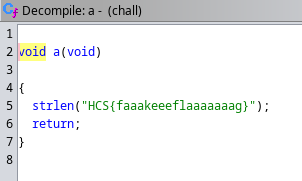
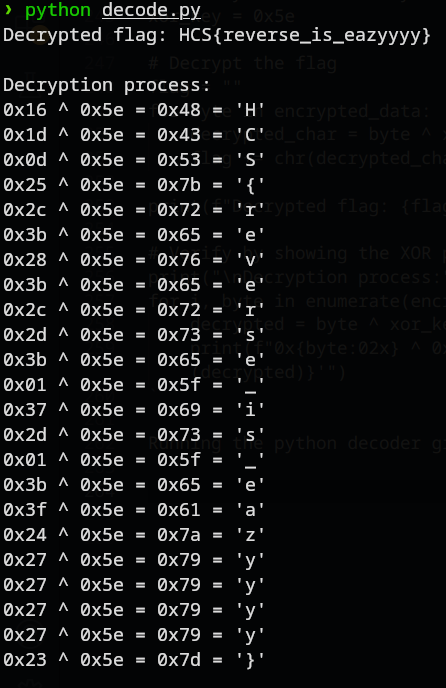

# Reverse Day 1
### Description: Ketika pertama kali belajar reverse engineering, biasanya challenge bisa di-solved cukup dengan strings. Sayangnya, kali ini strings saja belum bisa untuk mendapatkan flag.

We are given a binary file ```chall```

Running strings on the binary reveals nothing, as indicated by the challenge description. Instead, we got a red herring/fake flag:

```
❯ strings chall
HCS{faaakeeeflaaaaaaag}
Wrong!
GG!, dont forget to submit your flag!
Usage: %s <flag>
Incorrect length!
:*3$"
```

I then opened Ghidra to begin static analysis on the binary. (wow so cool xd)

Looking around, i found a function which contains a flag, but it's the red herring we found at strings:



And then there's a function called "check":

```
void check(long param_1)

{
  long lVar1;
  int iVar2;
  ulong uVar3;
  undefined *puVar4;
  long in_FS_OFFSET;
  undefined auStack_88 [8];
  long local_80;
  byte local_71;
  int local_70;
  int local_6c;
  long local_68;
  undefined *local_60;
  undefined8 local_58;
  undefined8 local_50;
  undefined4 local_48;
  undefined2 local_44;
  undefined local_42;
  long local_40;
  
  local_40 = *(long *)(in_FS_OFFSET + 0x28);
  local_58 = 0x3b283b2c250d1d16;
  local_50 = 0x3b012d37013b2d2c;
  local_48 = 0x2727243f;
  local_44 = 0x2727;
  local_42 = 0x23;
  local_71 = 0x5e;
  local_80 = param_1;
  iVar2 = a();
  local_68 = (long)(iVar2 + 1) + -1;
  uVar3 = (((long)(iVar2 + 1) + 0xfU) / 0x10) * 0x10;
  for (puVar4 = auStack_88; puVar4 != auStack_88 + -(uVar3 & 0xfffffffffffff000);
      puVar4 = puVar4 + -0x1000) {
    *(undefined8 *)(puVar4 + -8) = *(undefined8 *)(puVar4 + -8);
  }
  lVar1 = -(ulong)((uint)uVar3 & 0xfff);
  if ((uVar3 & 0xfff) != 0) {
    *(undefined8 *)(puVar4 + ((ulong)((uint)uVar3 & 0xfff) - 8) + lVar1) =
         *(undefined8 *)(puVar4 + ((ulong)((uint)uVar3 & 0xfff) - 8) + lVar1);
  }
  local_70 = 0;
  local_60 = puVar4 + lVar1;
  while( true ) {
    *(undefined8 *)(puVar4 + lVar1 + -8) = 0x101320;
    iVar2 = a();
    if (iVar2 <= local_70) break;
    local_60[local_70] = *(byte *)((long)&local_58 + (long)local_70) ^ local_71;
    local_70 = local_70 + 1;
  }
  *(undefined8 *)(puVar4 + lVar1 + -8) = 0x10132a;
  iVar2 = a();
  local_60[iVar2] = 0;
  local_6c = 0;
  while( true ) {
    *(undefined8 *)(puVar4 + lVar1 + -8) = 0x101380;
    iVar2 = a();
    if (iVar2 <= local_6c) break;
    if (*(char *)(local_80 + local_6c) != local_60[local_6c]) {
      *(undefined8 *)(puVar4 + lVar1 + -8) = 0x10136d;
      puts("Wrong!");
                    /* WARNING: Subroutine does not return */
      *(undefined8 *)(puVar4 + lVar1 + -8) = 0x101377;
      exit(1);
    }
    local_6c = local_6c + 1;
  }
  *(undefined8 *)(puVar4 + lVar1 + -8) = 0x101394;
  puts("GG!, dont forget to submit your flag!");
  if (local_40 != *(long *)(in_FS_OFFSET + 0x28)) {
                    /* WARNING: Subroutine does not return */
    __stack_chk_fail();
  }
  return;
}
```

There seems to be variables here, possibly storing encrypted flag data and other parameters of the program:
```
local_58 = 0x3b283b2c250d1d16;
local_50 = 0x3b012d37013b2d2c;
local_48 = 0x2727243f;
local_44 = 0x2727;
local_42 = 0x23;
local_71 = 0x5e;
local_80 = param_1;
```

And also, ```local_71 = 0x5e;``` is valued 94 in decimal, a XOR key perhaps?

Now this line in the decompiled code is interesting:
```
while( true ) {
    iVar2 = a();
    if (iVar2 <= local_6c) break;
    if (*(char *)(local_80 + local_6c) != local_60[local_6c]) {
        puts("Wrong!");
        exit(1);
    }
    local_6c = local_6c + 1;
}
```

This compares the user's input (param_1 as local_80) char by char against the decrypted flag (local_60). If they match completely, it prints "GG!, dont forget to submit your flag!".

And then this decompiled code shows us the decryption loop:
```
while( true ) {
    iVar2 = a();
    if (iVar2 <= local_70) break;
    local_60[local_70] = *(byte *)((long)&local_58 + (long)local_70) ^ local_71;
    local_70 = local_70 + 1;
}
```

The code basically iterates through each byte of the encrypted data (&local_58 + local_70), XORs it with the key (local_71), and stores the result in local_60[local_70].

The function a() likely returns the length of the flag (probably 23 based on the data size), and the main() function ensures the user input has the correct length before calling check().

Based on these observations, we can draft a decoder to print the flag:

```
#!/usr/bin/env python3

# Encrypted data from the binary
encrypted_data = [
    0x16, 0x1d, 0x0d, 0x25, 0x2c, 0x3b, 0x28, 0x3b,  # First 8 bytes
    0x2c, 0x2d, 0x3b, 0x01, 0x37, 0x2d, 0x01, 0x3b,  # Next 8 bytes
    0x3f, 0x24, 0x27, 0x27, 0x27, 0x27, 0x23          # Remaining bytes
]

# XOR key from the binary
xor_key = 0x5e

# Decrypt the flag
flag = ""
for byte in encrypted_data:
    decrypted_char = byte ^ xor_key
    flag += chr(decrypted_char)

print(f"Decrypted flag: {flag}")

# Verify by showing the XOR process
print("\nDecryption process:")
for i, byte in enumerate(encrypted_data):
    decrypted = byte ^ xor_key
    print(f"0x{byte:02x} ^ 0x{xor_key:02x} = 0x{decrypted:02x} = '{chr(decrypted)}'")
```

Running the python decoder gives us the flag:



Flag: ```HCS{reverse_is_eazyyyy}```

