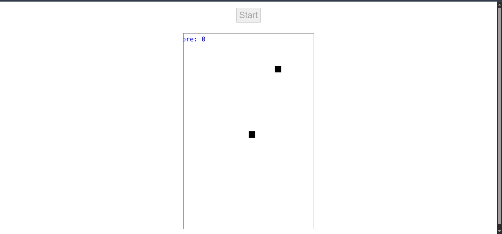
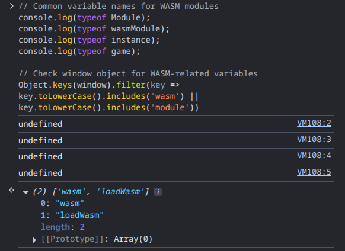
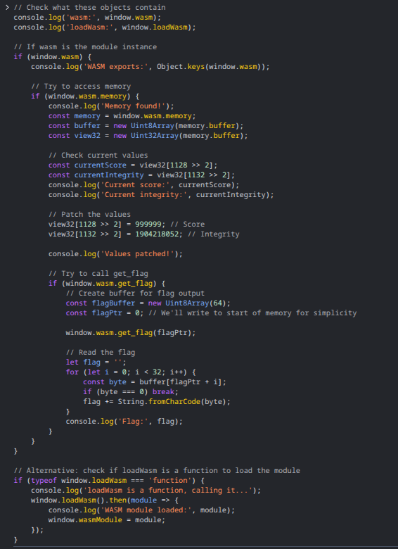
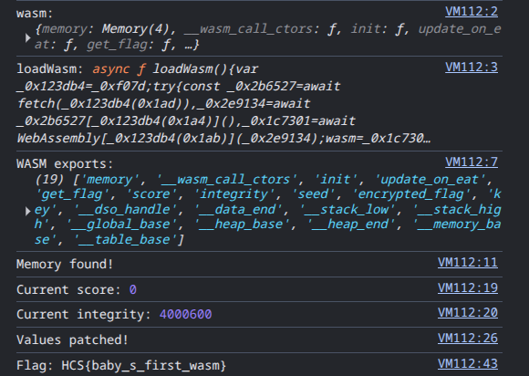

# Snakev3
### Description: pawang ular. ps, run dengan menggunakan command python -m http.server di directory yang sama dengan file file yang diberikan

We are given ```snakev3.zip``` zip file.

Unzipping it gives us the following:

```index.html```:
```
<!DOCTYPE html>
<html lang="en">

<head>
  <meta charset="UTF-8" />
  <title>JavaScript Snake Game</title>
  <link rel="stylesheet" href="app.css" />
</head>

<body>
  <input type="hidden" id="gameSpeed" value="9" min="9" max="9" step="1" />
  <input type="button" value="Start" id="gameStart" />
  <br /> <br />
  <canvas id="gameArea"></canvas>
  <script src="app.js"></script>
</body>

</html>
```

```app.css```:
```
body {
  font-family: -apple-system, BlinkMacSystemFont, 'Segoe UI', Roboto, Oxygen, Ubuntu, Cantarell, 'Open Sans', 'Helvetica Neue', sans-serif;
  margin: 20px auto;
  text-align: center;
  font-size: 150%;
}

input {
  font-size: 100%;
  text-align: center;
  padding: 5px 7px;
}
```

```app.js```:
```
'use strict';(function(_0x29ff9b,_0x55e62a){var _0x1bb2c7=_0xf07d,_0x2681b1=_0x29ff9b();while(!![]){try{var _0x41d70e=parseInt(_0x1bb2c7(0x199))/0x1+-parseInt(_0x1bb2c7(0x1c4))/0x2*(-parseInt(_0x1bb2c7(0x1b9))/0x3)+parseInt(_0x1bb2c7(0x1c6))/0x4+parseInt(_0x1bb2c7(0x1a7))/0x5*(parseInt(_0x1bb2c7(0x1bb))/0x6)+-parseInt(_0x1bb2c7(0x1a5))/0x7*(parseInt(_0x1bb2c7(0x1c3))/0x8)+parseInt(_0x1bb2c7(0x194))/0x9+parseInt(_0x1bb2c7(0x191))/0xa*(-parseInt(_0x1bb2c7(0x198))/0xb);if(_0x41d70e===_0x55e62a)break;else _0x2681b1['push'](_0x2681b1['shift']());}catch(_0x5d2dfa){_0x2681b1['push'](_0x2681b1['shift']());}}}(_0x467b,0x52cab));var gameStart={},gameSpeed={},gameArea={},gameAreaContext={},snake=[],gameAreaWidth=0x0,gameAreaHeight=0x0,cellWidth=0x0,playerScore=0x0,snakeFood={},snakeDirection='',speedSize=0x0,timer={},wasm;function _0x467b(){var _0x2e3dc9=['20px\x20sans-serif','grow','memory','left','#gameArea','error','buffer','init','arrayBuffer','1076257SEAImP','#FFFFFF','10AndIcS','disabled','keydown','width','instantiate','down','game.wasm','fillStyle','fillRect','querySelector','get_flag','WASM\x20module\x20loaded\x20successfully.','#ff0000','unshift','length','log','decode','right','274059YRpCQa','Error\x20loading\x20WASM\x20module:','639714NEfoHC','#gameSpeed','round','#gameStart','#000000','addEventListener','Failed\x20to\x20load\x20game\x20components.\x20Please\x20check\x20the\x20console.','strokeRect','16NbknSg','10WNYMRt','exports','478276xAPHFu','getContext','click','fillText','40dGJShK','byteLength','indexOf','4092093suxqQN','slice','value','font','3204938Tnbpao','567800cZDSzO','height','update_on_eat'];_0x467b=function(){return _0x2e3dc9;};return _0x467b();}async function loadWasm(){var _0x123db4=_0xf07d;try{const _0x2b6527=await fetch(_0x123db4(0x1ad)),_0x2e9134=await _0x2b6527[_0x123db4(0x1a4)](),_0x1c7301=await WebAssembly[_0x123db4(0x1ab)](_0x2e9134);wasm=_0x1c7301['instance'][_0x123db4(0x1c5)],console[_0x123db4(0x1b6)](_0x123db4(0x1b2));}catch(_0x514b3e){console[_0x123db4(0x1a1)](_0x123db4(0x1ba),_0x514b3e),alert(_0x123db4(0x1c1));}}function _0xf07d(_0x204a0d,_0x2aacf1){var _0x467b22=_0x467b();return _0xf07d=function(_0xf07df8,_0x3261f3){_0xf07df8=_0xf07df8-0x190;var _0x1bf4b2=_0x467b22[_0xf07df8];return _0x1bf4b2;},_0xf07d(_0x204a0d,_0x2aacf1);}function initElement(){var _0x40dcbc=_0xf07d;gameStart=document['querySelector'](_0x40dcbc(0x1be)),gameSpeed=document[_0x40dcbc(0x1b0)](_0x40dcbc(0x1bc)),gameArea=document['querySelector'](_0x40dcbc(0x1a0)),gameAreaContext=gameArea[_0x40dcbc(0x1c7)]('2d'),gameAreaWidth=0x190,gameAreaHeight=0x258,cellWidth=0x14,gameArea[_0x40dcbc(0x1aa)]=gameAreaWidth,gameArea[_0x40dcbc(0x19a)]=gameAreaHeight;}function createFood(){var _0x7908e4=_0xf07d;snakeFood={'x':Math[_0x7908e4(0x1bd)](Math['random']()*(gameAreaWidth-cellWidth)/cellWidth),'y':Math[_0x7908e4(0x1bd)](Math['random']()*(gameAreaHeight-cellWidth)/cellWidth)};}function checkCollision(_0x3267cc,_0x4d7596,_0x4330fa){var _0x3fbf83=_0xf07d;for(let _0x1ec0fa=0x0;_0x1ec0fa<_0x4330fa[_0x3fbf83(0x1b5)];_0x1ec0fa++){if(_0x4330fa[_0x1ec0fa]['x']==_0x3267cc&&_0x4330fa[_0x1ec0fa]['y']==_0x4d7596)return!![];}return![];}function writeScore(){var _0x264306=_0xf07d;gameAreaContext[_0x264306(0x197)]='20px\x20sans-serif',gameAreaContext[_0x264306(0x1ae)]='#0000FF',gameAreaContext[_0x264306(0x190)]('Score:\x20'+playerScore,0x14,0x19);}function createSquare(_0x281d66,_0x2cc39e){var _0xd7caac=_0xf07d;gameAreaContext[_0xd7caac(0x1ae)]='#000000',gameAreaContext[_0xd7caac(0x1af)](_0x281d66*cellWidth,_0x2cc39e*cellWidth,cellWidth,cellWidth);}function createGameArea(){var _0x269cf6=_0xf07d;let _0x21f7a5=snake[0x0]['x'],_0x39cc18=snake[0x0]['y'];gameAreaContext[_0x269cf6(0x1ae)]=_0x269cf6(0x1a6),gameAreaContext[_0x269cf6(0x1af)](0x0,0x0,gameAreaWidth,gameAreaHeight),gameAreaContext['strokeStyle']=_0x269cf6(0x1bf),gameAreaContext[_0x269cf6(0x1c2)](0x0,0x0,gameAreaWidth,gameAreaHeight),writeScore();if(snakeDirection=='right')_0x21f7a5++;else{if(snakeDirection==_0x269cf6(0x19f))_0x21f7a5--;else{if(snakeDirection=='down')_0x39cc18++;else{if(snakeDirection=='up')_0x39cc18--;}}}if(_0x21f7a5==-0x1||_0x21f7a5==gameAreaWidth/cellWidth||_0x39cc18==-0x1||_0x39cc18==gameAreaHeight/cellWidth||checkCollision(_0x21f7a5,_0x39cc18,snake)){clearInterval(timer),gameStart[_0x269cf6(0x1a8)]=![];const _0x2c6376=wasm[_0x269cf6(0x19e)][_0x269cf6(0x1a2)][_0x269cf6(0x192)],_0x5bedc1=0x32;wasm[_0x269cf6(0x19e)][_0x269cf6(0x19d)](0x1),wasm[_0x269cf6(0x1b1)](_0x2c6376);const _0x22c880=new Uint8Array(wasm[_0x269cf6(0x19e)]['buffer'],_0x2c6376,_0x5bedc1),_0x1a7b4f=_0x22c880[_0x269cf6(0x193)](0x0),_0x418769=new TextDecoder()[_0x269cf6(0x1b7)](_0x22c880[_0x269cf6(0x195)](0x0,_0x1a7b4f));gameAreaContext[_0x269cf6(0x1ae)]=_0x269cf6(0x1b3),gameAreaContext[_0x269cf6(0x197)]=_0x269cf6(0x19c),gameAreaContext['textAlign']='center',gameAreaContext[_0x269cf6(0x190)](_0x418769,gameAreaWidth/0x2,gameAreaHeight/0x2);return;}let _0x33f123={'x':_0x21f7a5,'y':_0x39cc18};_0x21f7a5==snakeFood['x']&&_0x39cc18==snakeFood['y']?(playerScore+=speedSize,wasm[_0x269cf6(0x19b)](),createFood()):snake['pop']();snake[_0x269cf6(0x1b4)](_0x33f123);for(let _0x55c4b7=0x0;_0x55c4b7<snake[_0x269cf6(0x1b5)];_0x55c4b7++){createSquare(snake[_0x55c4b7]['x'],snake[_0x55c4b7]['y']);}createSquare(snakeFood['x'],snakeFood['y']);}function startGame(){var _0x1ac8e=_0xf07d;const _0x391f7f=gameAreaWidth*0x2710+gameAreaHeight;wasm[_0x1ac8e(0x1a3)](_0x391f7f),snake=[{'x':0x5,'y':0x5}],createFood(),clearInterval(timer),timer=setInterval(createGameArea,0x1f4/speedSize);}function onStartGame(){var _0xd7dba8=_0xf07d;this[_0xd7dba8(0x1a8)]=!![],playerScore=0x0,snakeDirection=_0xd7dba8(0x1b8),speedSize=parseInt(gameSpeed[_0xd7dba8(0x196)]);if(speedSize>0x9)speedSize=0x9;else{if(speedSize<0x1)speedSize=0x1;}startGame();}function changeDirection(_0xcf15b0){var _0x5bd703=_0xf07d;const _0xbe3e7e=_0xcf15b0['which'];if(_0xbe3e7e=='40'&&snakeDirection!='up')snakeDirection='down';else{if(_0xbe3e7e=='39'&&snakeDirection!=_0x5bd703(0x19f))snakeDirection='right';else{if(_0xbe3e7e=='38'&&snakeDirection!=_0x5bd703(0x1ac))snakeDirection='up';else{if(_0xbe3e7e=='37'&&snakeDirection!=_0x5bd703(0x1b8))snakeDirection=_0x5bd703(0x19f);}}}}function initEvent(){var _0x40d28f=_0xf07d;gameStart[_0x40d28f(0x1c0)](_0x40d28f(0x1c8),onStartGame),window[_0x40d28f(0x1c0)](_0x40d28f(0x1a9),changeDirection);}async function init(){await loadWasm(),initElement(),initEvent();}window['addEventListener']('DOMContentLoaded',init);
```

```game.wasm``` file.

```game.wat``` file.

Pressing start, we can play a Snake game:



I lost many times since it is obviously designed to be exploited, not solved by playing.

Looking at game.wat, i found this function which presumably gives us the flag:

```
(func $get_flag (type 1) (param i32)
    block  ;; label = @1
      block  ;; label = @2
        i32.const 0
        i32.load offset=1128
        i32.const 999999
        i32.ne
        br_if 0 (;@2;)
        i32.const 0
        i32.load offset=1132
        i32.const 1904218052
        i32.eq
        br_if 1 (;@1;)
      end
```

Flag conditions (in get_flag function):

Score must equal exactly 999999, stored at offset 1128.

Integrity check must equal 1904218052 that of which is stored at offset 1132.

The following are game mechanics found on further analysis of game.wat:

```init```: Sets initial score and seed values

```update_on_eat```: Will be called when the snake eats food

This function adds 9 to score and updates integrity using: 
```integrity = (seed + score) XOR (integrity rotated left by 5)```.

If the above conditions are met, it XORs two data sections, which are:

Encrypted flag at offset 1104-1126 (23 bytes) and Key at offset 1072-1094 (23 bytes).

From the .data section of ```game.wat``` we can infer that the Key (offset 1072): ```?&?\18\0d\0c\07&+\1c\00\12\01\17,&\1a(\02\1f\18\1f\00\00\00\00\00\00\00\00\00\00welcome_to_the_RE_club\00```

Now that the game is running in a browser window, we now find the WASM instance by running this code in the browser console:

```
// Common variable names for WASM modules
console.log(typeof Module);
console.log(typeof wasmModule);
console.log(typeof instance);
console.log(typeof game);

// Check window object for WASM-related variables
Object.keys(window).filter(key => key.toLowerCase().includes('wasm') || key.toLowerCase().includes('module'))
```


Now that we found some WASM-related objects. Let's try accessing them and hopefully get the flag:

```
// Check what these objects contain
console.log('wasm:', window.wasm);
console.log('loadWasm:', window.loadWasm);

// If wasm is the module instance
if (window.wasm) {
    console.log('WASM exports:', Object.keys(window.wasm));
    
    // Try to access memory
    if (window.wasm.memory) {
        console.log('Memory found!');
        const memory = window.wasm.memory;
        const buffer = new Uint8Array(memory.buffer);
        const view32 = new Uint32Array(memory.buffer);
        
        // Check current values
        const currentScore = view32[1128 >> 2];
        const currentIntegrity = view32[1132 >> 2];
        console.log('Current score:', currentScore);
        console.log('Current integrity:', currentIntegrity);
        
        // Patch the values
        view32[1128 >> 2] = 999999; // Score
        view32[1132 >> 2] = 1904218052; // Integrity
        
        console.log('Values patched!');
        
        // Try to call get_flag
        if (window.wasm.get_flag) {
            // Create buffer for flag output
            const flagBuffer = new Uint8Array(64);
            const flagPtr = 0; // We'll write to start of memory for simplicity
            
            window.wasm.get_flag(flagPtr);
            
            // Read the flag
            let flag = '';
            for (let i = 0; i < 32; i++) {
                const byte = buffer[flagPtr + i];
                if (byte === 0) break;
                flag += String.fromCharCode(byte);
            }
            console.log('Flag:', flag);
        }
    }
}

// Alternative: check if loadWasm is a function to load the module
if (typeof window.loadWasm === 'function') {
    console.log('loadWasm is a function, calling it...');
    window.loadWasm().then(module => {
        console.log('WASM module loaded:', module);
        window.wasmModule = module;
    });
}
```



Here's the outcome, and with it, the flag:



Flag: ```HCS{baby_s_first_wasm}```

