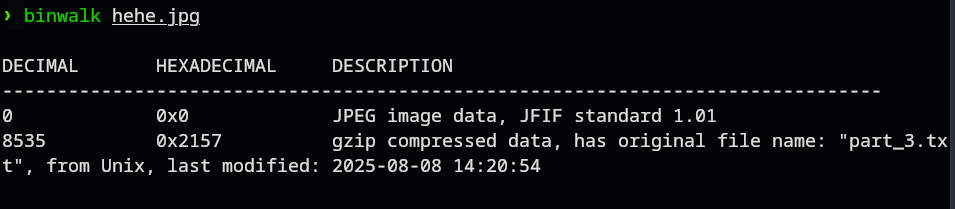
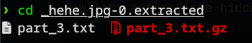
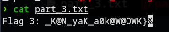
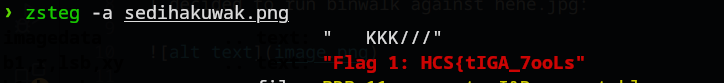
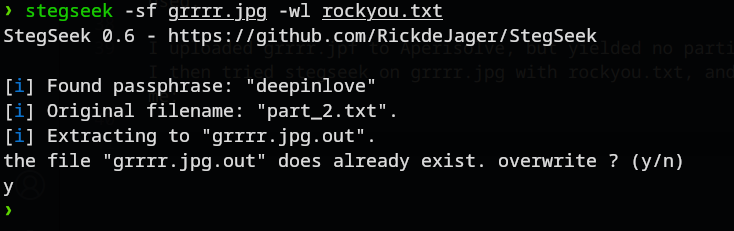
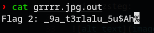

# Three Umazing Things
### Description: To Solve this you need three umazing tools to get the flag. Good Luck!

We are given 3 files, grrrr.jpg, hehe.jpg, and sedihakuwak.png.

The usual tools that i know of and commonly use about images are bless (hexeditor), binwalk (to extract hidden files), stegseek, stegsolve,  (to do steganography on an image), AperiSolve (on google, which combines many of these tools plus many other features).

I decided to run binwalk against hehe.jpg:



As we could see, there are indeed a hidden file inside, a gzip compressed data that has the original file name part_3.txt. 

This seem to indicate that the flag are split into 3 parts, with each corresponding image needing interaction with a unique tool to get each part of the flag, and i just happened to be correct on using binwalk on hehe.jpg.

Now lets extract the hidden file using 
```
binwalk -e hehe.jpg
```
Upon going to the extraction directory, we see part_3.txt:



Running cat on it gives us the flag:


Part 3 Flag: ```_K@N_yaK_a0k@W@OWK}```

Now for the second image and second tool.

I tried to use strings on sedihakuwak.png, but to no avail. So i tried zsteg:



On using zteg, the first flag part was revealed.

Part 1 Flag: ```HCS{tIGA_7ooLs```

Now there is only grrrr.jpg left, and 2 tools binwalk and zsteg was used.

I uploaded grrrr.jpf to Aperisolve, but yielded no particular result. I then tried stegseek on grrrr.jpg with rockyou.txt, and it surprised me:



Ignore overwrite, this was done post-competition.

Opening grrrr.jpg.out give us the last piece of the flag:



Part 2 Flag: ```_9a_t3rlalu_5u$Ah```

Combining all 3 parts give us the flag to solve the challenge.

Flag: ```HCS{tIGA_7ooLs_9a_t3rlalu_5u$Ah_K@N_yaK_a0k@W@OWK}```