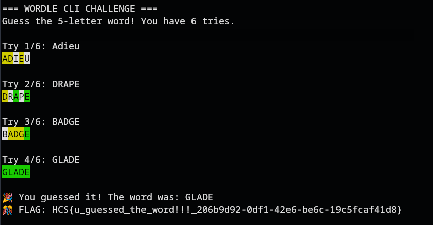

# Wordle
### Description: ini challenge gampang sih...

We are given a netcat to a Wordle CLI game.

Wordle is where you guess 5 letter words, if your guess contains the letter but is incorrect position wise, the letter will be Yellow. If it is the correct letter and position, it will be Green. Otherwise it'll be White.

I started guessing, and eventually got the flag:



Flag: ```HCS{u_guessed_the_word!!!_206b9d92-0df1-42e6-be6c-19c5fcaf41d8}```