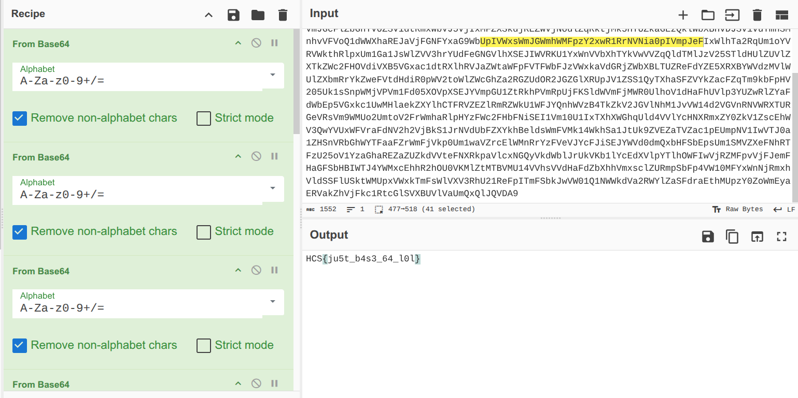

# based
### Description: They didn’t hide the flag… they just buried it alive.

Okay so, based on the challenge title, we are probably dealing with BaseXX encryption and must decode it somehow. The description implies that there are no complicated algorithm designed to protect the encrypted data, just that it's "buried" which may mean that repeated use of BaseXX encryption was done to "bury" the original string.

We are given a ```chall.zip``` zip file.

Unzipping it gives us output.txt:
```
Vm0wd2QyUXlWa1pPVldSWFYwZG9WRll3Wkc5V1ZteDBaRWhrVmxac2NEQlVWbHBQVm1zeFdHVkliRmhoTVhCUVZtcEdTMlJIVmtkaVJuQk9UVEJLU1ZadE1IaFRNVWw1Vkd0c2FWSnRVbGhVVkVaTFpWWmFkR05GU214U2JWSllWVzAxUzJGc1NuVlJiVGxhVjBoQ1dGcFdXbUZqTVZwMFVteHdWMDFWY0ZsV1Z6QXhWREpHYzFOdVVtaFNiWGhYVkZWYVlWUkdVblJsUjBacVRWZFNNRlZ0ZUc5aFZscHlWMVJDVjAxdVVuWldha1phWlZaT2NscEhjRk5pUlhCb1YxWlNSMWxXYkZkVmJGcFlZbGhTV0ZSV1dtRmxWbVJ5VjIxMFZXSkdjREZWVjNodlZqRktjMk5HYUZkaGEzQklWbXBHVDJSV1VuTmhSMnhvVFVoQ1dWWXhaREJaVjFGNFYxaG9WbUpIVWxsWmJGWmhWMFpzY2xwR1RrNVNia0pIVmpJeFIxWlhTa2RqUm1oYVRVWkthRlpxUm1Ga1JsWlZVV3hrYUdFeGNGVlhXSEJIWVRKU1YxWnVVbXhTYkVwVVZqQldTMlJzV25STldHUlZUVlZXTkZWc2FHOVdiVXB5VGxac1dtRXlhRVJaZWtaWFpFVTFWbFJzVWxkaVdGRjZWbXBLTUZReFdYZE5XRXBYWVdzMVlWUlZXbmRrYkZweFVtdHdiR0pWV2toWlZWcGhZa2RGZUdOR2JGZGlXRUpJV1ZSS1QyTXhaSFZVYkZacFZqTm9kbFpHV205Uk1sSnpWMjVPVm1Fd05XOVpXSEJYVmpGU1ZtRkhPVmRpUjFKSldWVmFjMWR0UlhoV1dHaFhUVlp3YUZwRlZYaFdWbEp5VGxkc1UwMHlaekZXYlhCTFRVZEZlRmRZWkU1WFJYQnhWVzB4TkZkV2JGVlNhM1JvVW14d2VGVnRNVWRXTURGeVRsVm9WMUo2UmtoV2FrWmhaRlpHYzFWc2FHbFNiSEI1Vm10U1IxTXhXWGhqUld4VVlYcHNXRmxZY0ZkV1ZscEhWV3QwYVUxWFVraFdNV2h2VjBkS1JrNVdUbFZXYkhBeldsWmFVMk14WkhSa1JtUk9ZVEZaTVZac1pEUmpNV1IwVTJ0a1ZHSnVRbGhWYTFaaFZrWmFjVkp0Um1waVZrcElWMnRrYzFVeVJYcFJiSEJYWVd0dmQxbHFSbEpsUm1SMVZXeFNhRTFzU25oV1YzaGhaREZaZUZkdVVteFNXRkpaVlcxNGQyVkdWblJrUkVKb1lYcEdXVlpYTlhOWFIwVjRZMFpvVjFJemFHaGFSbHBIWTJ4YWMxcEhhR2hOU0VKMlZtMTBVMU14VVhsVVdHaFdZbXhhVmxsclZURmpSbFp4VW10MFYxWnNjRmxhVldSSFlUSktWMUpxVWxkTmFsWlVXV3RhU21ReFpITmFSbkJwVW01Q1NWWkdVa2RWYlZaSFdraEthMUpzY0ZoWmEyaERVakZhVjFkc1RtcGlSVXBUVlVaUmQxQlJQVDA9 
```

From the pattern of the string here, we can immediately identify that it's Base64 that's used to "bury" the flag.

Pulling out cyberchef, i stacked "From Base64" option so, so, so many times that my hands are starting to ache and my fingers numb. But we got the flag:



Flag: ```HCS{ju5t_b4s3_64_l0l}```