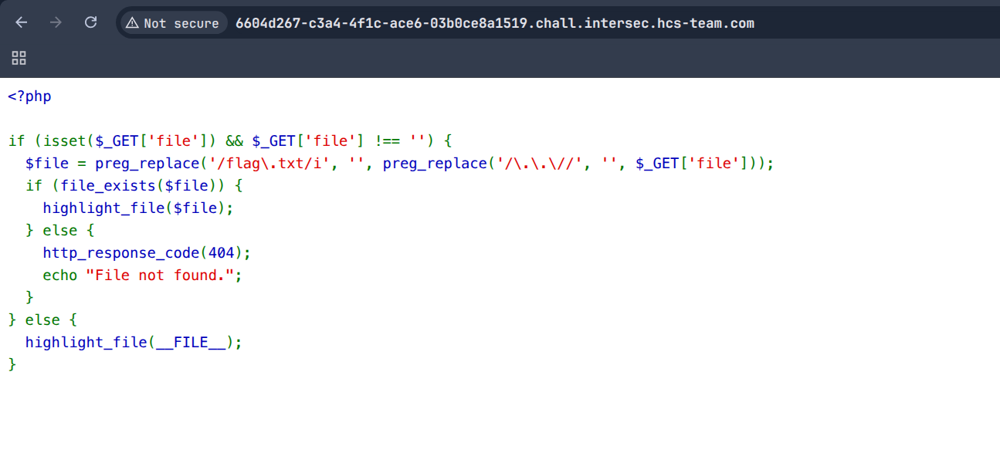
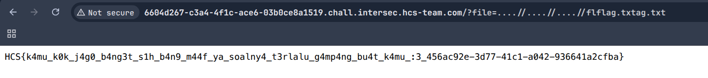

# elefay
### Description: Flag file in /flag.txt

We are given a link to go to a website.

Assuming from the challenge title, this is probably going to be another LFI 

Here is the initial display of the website:



What we can gather is:

1. ```preg_replace('/\.\.\//', '', $_GET['file'])```  removes ../ sequences

2. ```preg_replace('/flag\.txt/i', '', ...)``` removes flag.txt (case insensitive)

The regex ```/\.\.\/``` looks for literal ../ patterns.

```....//``` doesn't match because it's .. followed by .// (not ../).

The regex ```/flag\.txt/i``` finds and removes flag.txt, and we could exploit this by making a link to /flag.txt look like this:

```flflag.txtag.txt```, which contains flag.txt in the middle, and when flag.txt is removed, fl + ag.txt = ```flag.txt```


Now based on that, we can try appending this to the website link:

```
?file=....//....//....//flflag.txtag.txt
```


And the flag is printed:



Flag: ```HCS{k4mu_k0k_j4g0_b4ng3t_s1h_b4n9_m44f_ya_soalny4_t3rlalu_g4mp4ng_bu4t_k4mu_:3_456ac92e-3d77-41c1-a042-936641a2cfba}```