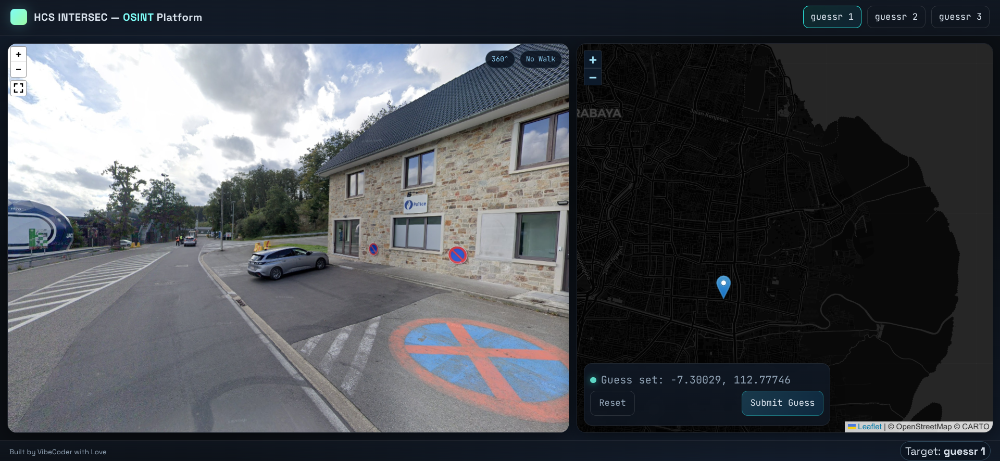
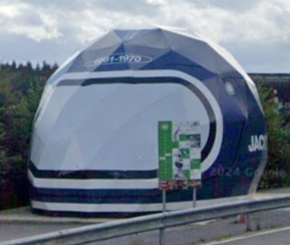
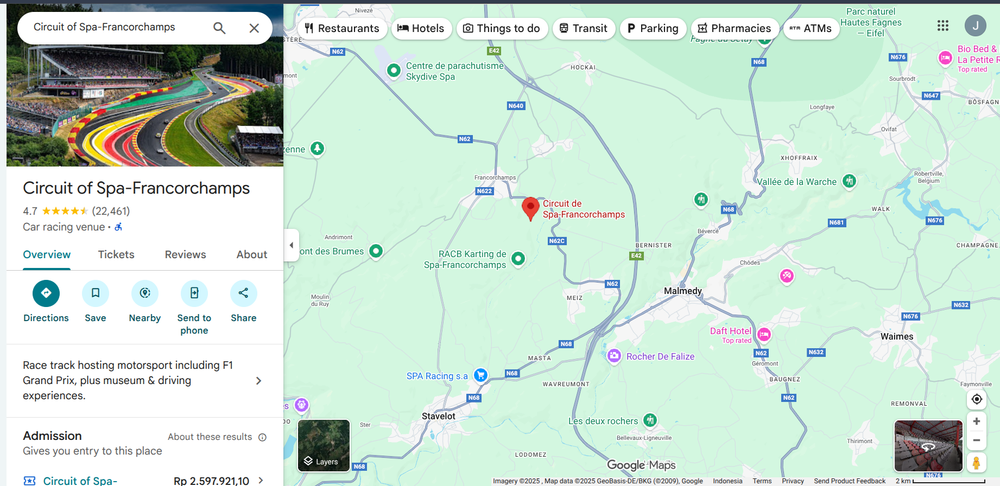
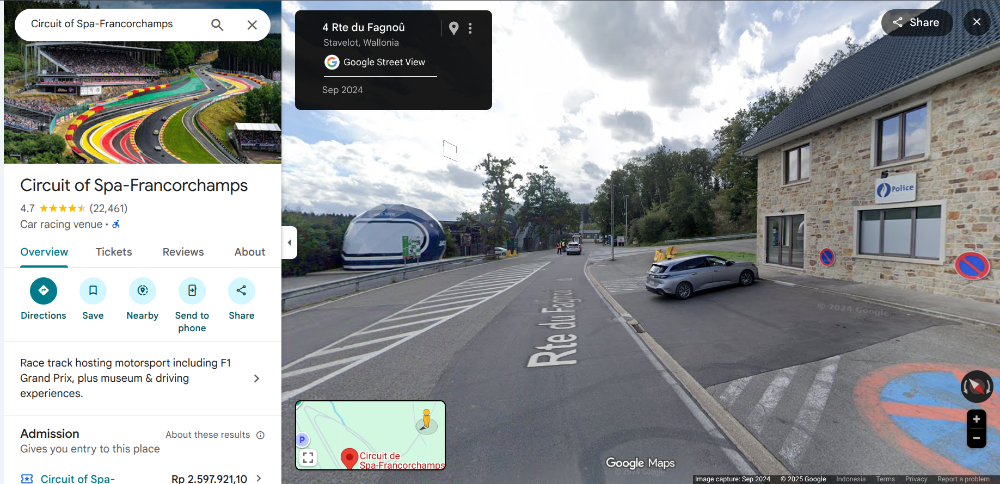
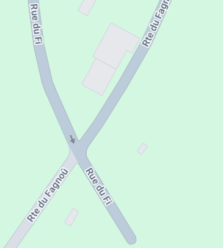
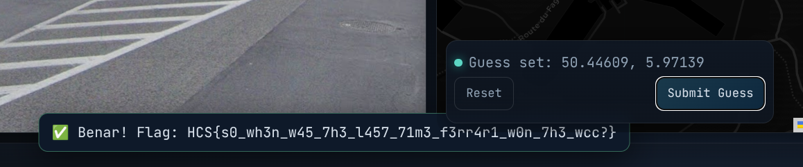

# guessr1
### Description: "must be the wind water."

We are given a link in the description.

Following that link, we are transported to what seems like a GeoGuessr website with options to place a pin on the map and make a guess based on the coordinates of the placed pin.

For those who don't know, GeoGuessr is a web application where people can try to guess where they are located based on Google Street View feed, and get points if competing against other players.

This type of guess-the-location is very common in OSINT CTF competitions.



Starting off, i noticed the surrounding area looks western-european, possibly either british, or the Benelux region (Belgium, Netherlands, Luxembourg) by the dreary and cloudy weather, western-european architecture that are common in the late 1800s to 1900s, and the woods interspersed along roads (which implies it's not a highway-centric nation like the USA).

Anyway, i noticed this ball-shaped-thing looks very out of place, and we may get good results if we reverse image search it:



Sure enough, the first result points us to ```Circuit de Spa-Francorchamps```:


The place is apparently a race track just northwest of Malmedy, Belgium:



After digging around the area for like 10 minutes, i found the exact location displayed in the HCS Intersec OSINT platform on Google Maps street view:



It's exactly located in the right side of this "X" in the road, just north of the circuit:



Afterwards i placed the pin on the exact location, and got the flag:



Flag: ```HCS{s0_wh3n_w45_7h3_l457_71m3_f3rr4r1_w0n_7h3_wcc?}```