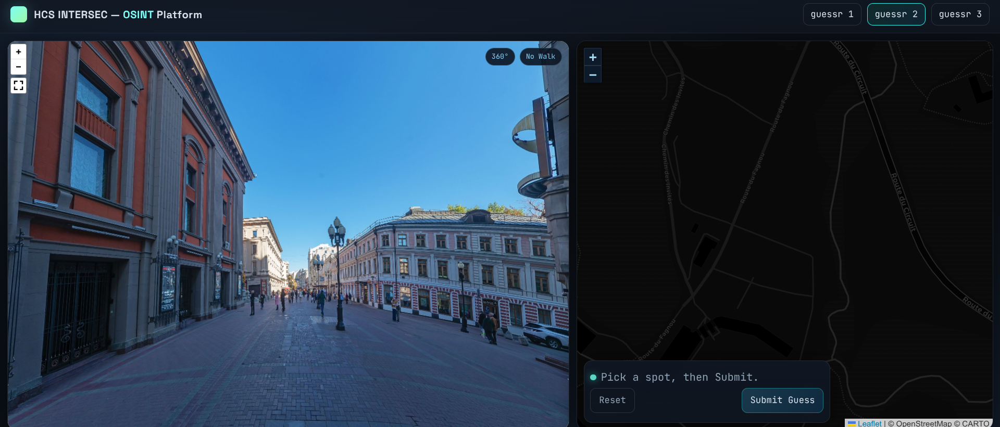
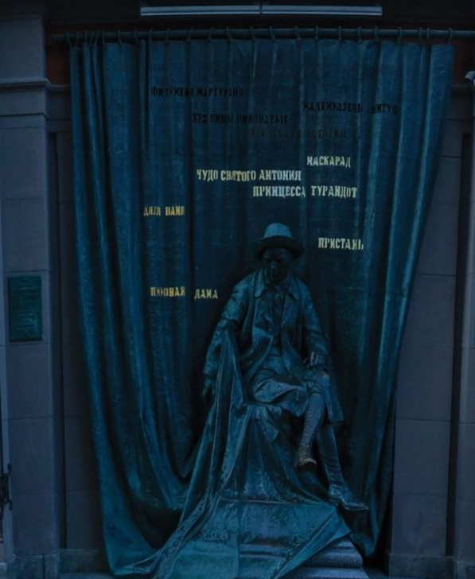
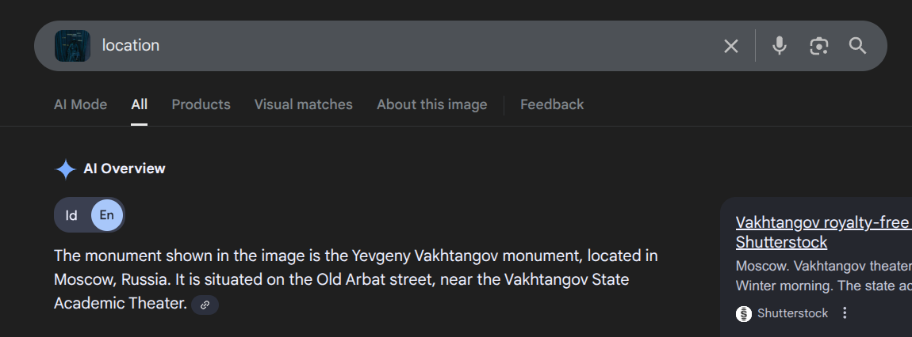
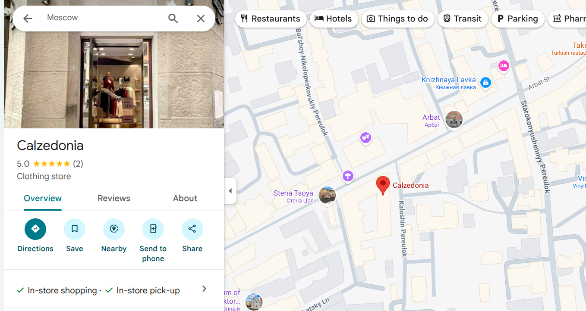
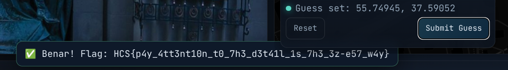

# guessr2
### Description: i dont understand the local language and lost my friend on the way. can you find out where i'm so my friend can pick me up?

Same as guessr1 before, this take place on the same site. 



Looking around, this place has eastern-european vibes, specifically more prestigious slavic-type (Think Kyiv, Moscow, St. Petersburg, Minsk, Warsaw) because it has early 1800s architectural style of overly elaborate buildings with many windows (which signifies wealth at the time) , and due to the clear skies. Clear skies like this on google street view is only taken on large cities on the eastern hemisphere, or the Caucasus region. Since there are no indo-turkish and middle eastern buildings around, it is definitely Eastern European.

If you look closely, the writings on this memorial is written in Cyrillic script, which is a writing script originating from Greek (Byzantium/Eastern Roman Empire) migrants that originally settled in Bulgaria, and went on to present day Ukraine, and onto Moscow, Siberia, and to the Far East into Mongolia during the times of the Soviet Union.

The existence of cyrillic script combined with the above info means this is most likely Moscow / Kiev.

And then i saw it:



Reverse image search on this statue revealed that we are in Arbat, a street just west from central Moscow:



And right infront of this statue we could see a "Calzedonia" clothing store, so after looking around in google maps on Arbat area, i found it:



The road on the north of Calzedonia is the location we need to submit, so, after placing the pin there, we got the flag:



Flag: ```HCS{p4y_4tt3nt10n_t0_7h3_d3t41l_1s_7h3_3z-e57_w4y}```

