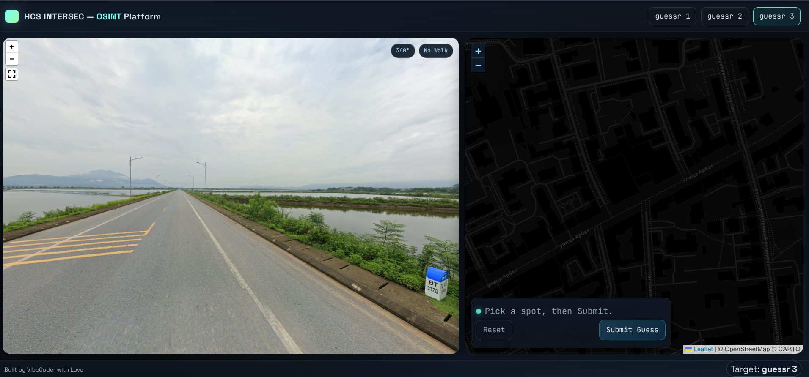
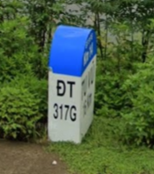
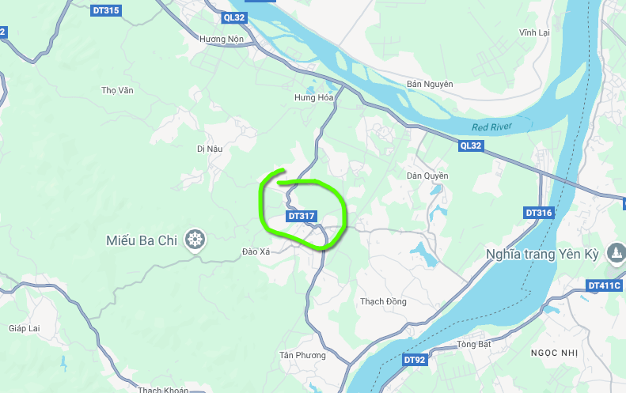
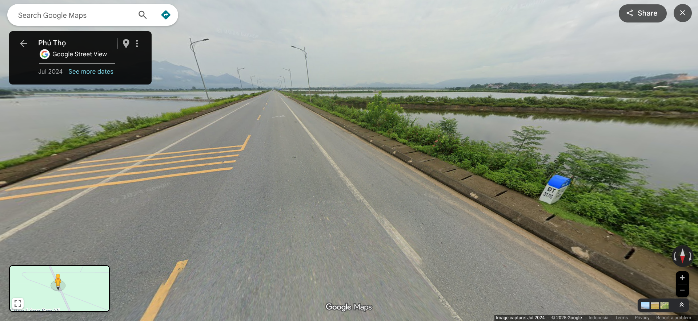
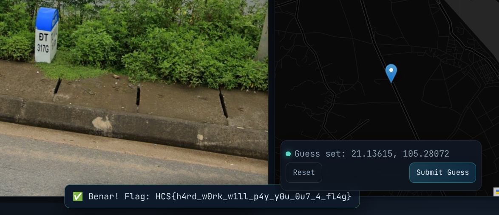

# guessr3
### Description: can you find out where this is before gta 6 released?

Still on the same platform, this time we are expected to find where we're on in literally nowhere:



Based on the skies and the existence of flooded fields (possibly unused rice paddy field) this is most likely South East Asia. Maybe Thailand, Laos, Vietnam, or Myanmar because Indonesia does not have this kind of street marking.



This street marker has the letter "D" that looks like the Viet letter, so i assumed it is vietnamese, and we are in vietnam.

I asked ChatGPT what does "317G" mean, and they said it is Road 317, on the "G" exit path/alternate path.


Looked it up on google maps, and we find that rd. 317 is to the west of Hanoi:



Zooming further into the image given, we could very barely make out "KM14":


This assumes the road marker is on Kilometer 14 of the road, and following the road from the north, i was still at KM 5, so i still have a long way to go.

After a long time of following the road, i found the exact place the photo is taken:



Now, the last thing to do is to place the map pin on the HCS Intersec Guessr application to get the flag:



Flag: ```HCS{h4rd_w0rk_w1ll_p4y_y0u_0u7_4_fl4g}```