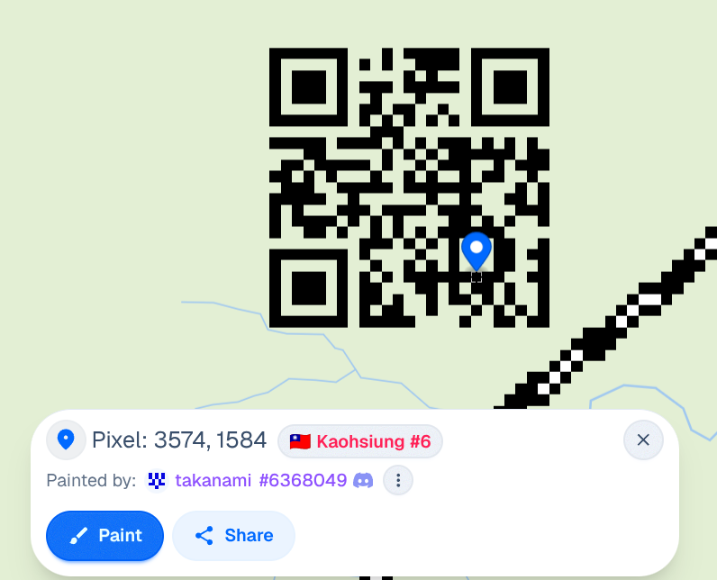
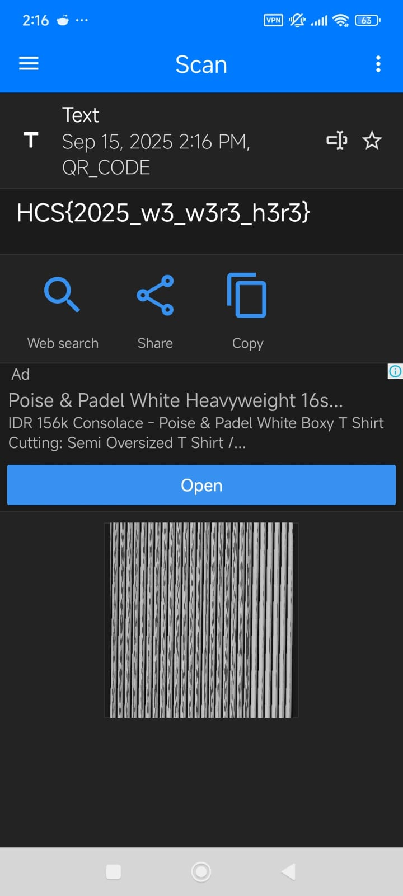

# multi-redact
### Description: my friend, hermann de franz, said he was interested in doing a trend he saw online. i wonder what he's done. note: once you find it, dont break it!

In this challenge, there is no attachment or link given.

The name "Hermann de Franz" is interesting, so i tried to look it up on google, only to find references to Max Verstappen :skull::


And then i tried looking up his name on Instagram, to no avail:


Almost gave up here, and abandoning the challenge altogether to pursue other ones since clock were ticking.

But the challenge maker announced that they were giving out a bounty to the first one to solve it, so that motivated me.

Tried once again looking up "Hermann de Franz" on reddit this time, and finally a clue popped up:


It's literally the only result, so this must be it.

Snooping around their post history on reddit, they apparently posted on the Wplace reddit community a QR code, with a very poor photographic skill:


This small tag tells us that the city the person is drawing on is Kaohsiung in Taiwan: 


And then the challenge author dropped a hint because nobody is yet to solve it:

```
scannable object

x-coords: between 3500 and 3600

{city}#6
```

"Scannable object" "x-coords" yeah now im convinced it's wplace. and in the screenshot, Kaohsiung is #6.

x coords between 3500 and 3600, so that means we only need to look vertically between x axis 3500-3600.

Found it, and it was painted by none other than the challenge author himself:



Scanning it, we got the flag:



Flag: ```HCS{2025_w3_w3r3_h3r3}```