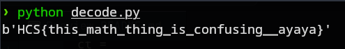

# square
### Description: RSA is very easy that I can implement my own!

We are given a ```chall.zip``` zip file.

Upon extraction, there is a python file called ```chal.py```:

```

p = getStrongPrime(1024)
q = p # it doesnt really matter, just random number

e = 0x10001
N = 21541800301192232014517202165412625094931695913164599975569157128232146089171300293678474808384855794086078814006810923631991331758895189968077257664801401349409195204180782061936397452574926250596148515837153809410943948038788634436527851012832822806373385466520949593420667657089983604355362661125427898525082805303008148206009981973943118917358398434585564741326047198888298309110188602078542887123319941536966163254961134273160983840654013709791372133147049303937488822991010462626117817658890197475186929755975726766797014365525684586160856619508893019386661217885417372093773624536889044601345891340353445957041

phi = (p-1)*q
ct = 8088116244766019483309701688819826250661842431328142103976015906811447261401523673713317947626782314922703222107051890688274695011147650052187009669953788734643296735599173856835918536158555225780013386411926183172002072470275045756087567557789070974506175750413094196121939662373077053522717392702200767345233292049895960656410593041191978740470159828964571047703024585266337043540973583736222234620044101650675504724790292073637984832696947731505667414713300475200800558368070629762227982414443123442539528170838576802996221065167959475605485954075793163964964704059010064163486744019964115296723955701150326849344
```

In this RSA challenge, there is a vulnerability in the way the key is generated:
```
p = getStrongPrime(1024)
q = p # it doesn't really matter, just random number
```
Setting q = p means N = p * q = p * p = p². This makes it trivial to break the RSA encryption by simply taking the square root of N to find p.

In a normal RSA, N = p × q where p and q are distinct large primes but in this challenge: N = p × p = p².

So to get the flag: Since N = p², we can simply calculate p = √N.

I drafted a solver with the help of GPT:
```
from Crypto.Util.number import long_to_bytes, inverse
from math import isqrt

# Given values
N = 21541800301192232014517202165412625094931695913164599975569157128232146089171300293678474808384855794086078814006810923631991331758895189968077257664801401349409195204180782061936397452574926250596148515837153809410943948038788634436527851012832822806373385466520949593420667657089983604355362661125427898525082805303008148206009981973943118917358398434585564741326047198888298309110188602078542887123319941536966163254961134273160983840654013709791372133147049303937488822991010462626117817658890197475186929755975726766797014365525684586160856619508893019386661217885417372093773624536889044601345891340353445957041
ct = 8088116244766019483309701688819826250661842431328142103976015906811447261401523673713317947626782314922703222107051890688274695011147650052187009669953788734643296735599173856835918536158555225780013386411926183172002072470275045756087567557789070974506175750413094196121939662373077053522717392702200767345233292049895960656410593041191978740470159828964571047703024585266337043540973583736222234620044101650675504724790292073637984832696947731505667414713300475200800558368070629762227982414443123442539528170838576802996221065167959475605485954075793163964964704059010064163486744019964115296723955701150326849344
e = 0x10001

# Step 1: recover p
p = isqrt(N)
assert p * p == N  # should be exact

# Step 2: compute phi
phi = (p - 1) * p

# Step 3: private key
d = inverse(e, phi)

# Step 4: decrypt
m = pow(ct, d, N)
flag = long_to_bytes(m)

print(flag)
```

Running it gives the flag:



Flag: ```HCS{this_math_thing_is_confusing__ayaya}```

