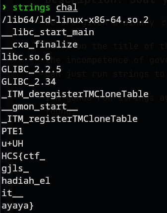

# strings
### Description: Soal yang wajib ada di CTF pemerintah

We are given a binary ```chal```.

Based on the title of the challenge, and the description which may imply the incompetence of government hosted things in Indonesia as of the making of this writeup, we can just run strings to get the flag.

I'm gonna run strings against the binary, and the flag is immediately found:



Flag: ```HCS{ctf_gjls_hadiah_elit__ayaya}```
