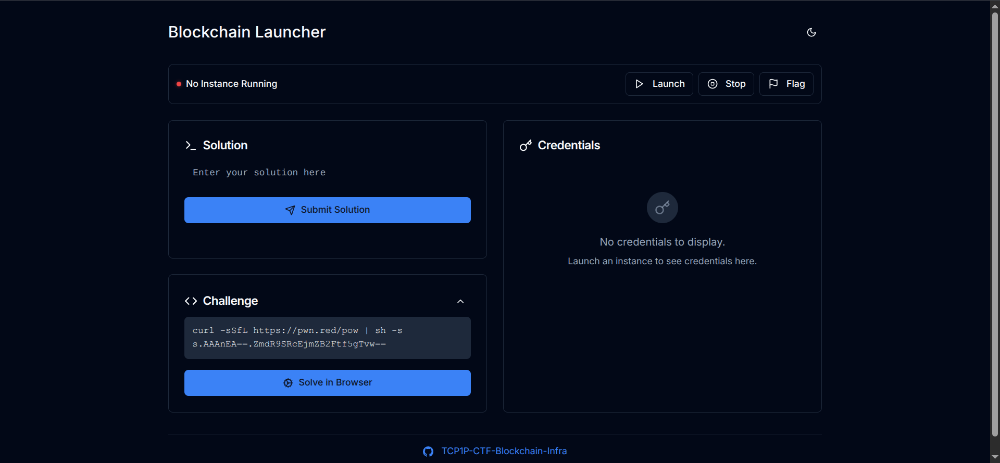
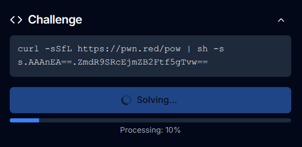
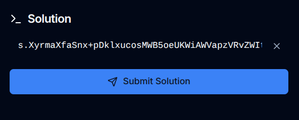
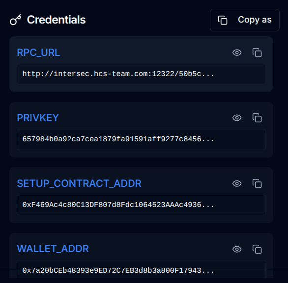
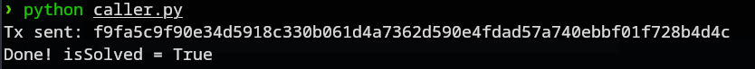
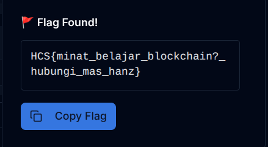

# toggle
### Description: Maw flag

We are given a link that leads to a Blockchain Launcher website:



We are also given a Setup.sol smart contract with a boolean solved state variable that starts as false. The goal is to call the solve() function to set it to true:
```
// SPDX-License-Identifier: UNLICENSED
pragma solidity ^0.8.0;

contract Setup {
    bool private solved;

    constructor() payable {
    }
    function solve() public {
        solved = true;
    }

    function isSolved() external view returns (bool) {
        return solved;
    }
}
```
The solve() function is public and unrestricted, meaning anyone can call it directly.

I clicked the Solve in Browser button for the Challenge tab, in order to submit a Solution to open an Instance:



After a while, it gave me the solution and i can start the instance now:



We are given 4 credentials: RPC URL, Private Key, Setup Contract Address, and Wallet Address:



Based on the given credentials, to solve the smart contract and get the flag, i drafted a python solver:
```
from web3 import Web3

rpc_url = "http://intersec.hcs-team.com:12322/50b5c092-4392-45ea-9398-bc3715b55d4f"
privkey = "657984b0a92ca7cea1879fa91591aff9277c8456b5f57cfae7dd44efb688d1d6"
setup_addr = "0xF469Ac4c80C13DF807d8Fdc1064523AAAc49369d"
wallet_addr = "0x7a20bCEb48393e9ED72C7EB3d8b3a800F1794306"

w3 = Web3(Web3.HTTPProvider(rpc_url))

abi = [
    {"inputs":[],"name":"solve","outputs":[],"stateMutability":"nonpayable","type":"function"},
    {"inputs":[],"name":"isSolved","outputs":[{"internalType":"bool","name":"","type":"bool"}],"stateMutability":"view","type":"function"}
]

contract = w3.eth.contract(address=setup_addr, abi=abi)
nonce = w3.eth.get_transaction_count(wallet_addr)

tx = contract.functions.solve().build_transaction({
    "from": wallet_addr,
    "nonce": nonce,
    "gas": 200000,
    "gasPrice": w3.to_wei("1", "gwei")
})

signed_tx = w3.eth.account.sign_transaction(tx, privkey)
tx_hash = w3.eth.send_raw_transaction(signed_tx.raw_transaction)
print("Tx sent:", tx_hash.hex())

receipt = w3.eth.wait_for_transaction_receipt(tx_hash)
print("Done! isSolved =", contract.functions.isSolved().call())

```
First we do the Web3 Setup by connecting to the provided RPC endpoint using Web3.py.

Afterwards we interact with the contract by creating a contract instance using the provided ABI (containing solve() and isSolved() functions).

Now we build a transaction calling solve() with appropriate gas parameters

Then we sign the transaction with the provided private key and broadcast it

Finally, we confirm success by calling isSolved() which should return true.

Ran the script:




I clicked ```Flag``` button on the webpage, and the flag is given:



Flag: ```HCS{minat_belajar_blockchain?_hubungi_mas_hanz}```