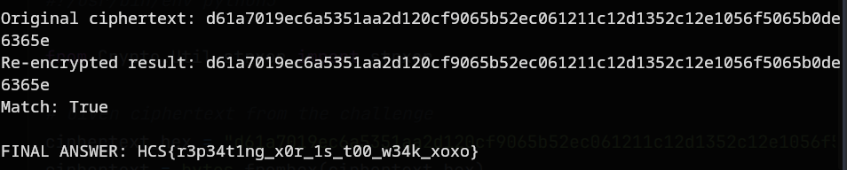

# xoxo
# Description: They tried to keep a secret in the relationship, but their habits gave everything away.

We are given a ```chall.zip``` zip file.

Unzipping it gives us a python file ```chall.py```.

Inside is the following code:
```
import os
from Crypto.Util.number import long_to_bytes
from Crypto.Util.strxor import strxor

FLAG = "HCS{placeholder}"

key = os.urandom(4) * 9

flag_bytes = FLAG.encode()

c = strxor(flag_bytes, key[:len(flag_bytes)])
print(c.hex())
#d61a7019ec6a5351aa2d120cf9065b52ec061211c12d1352c12e1056f5065b0de6365e
```

This looks like a XOR cipher with a repeating key vulnerability challenge.

```key = os.urandom(4) * 9``` creates a 4-byte random key repeated 9 times, or 36 bytes total.

XOR between flag bytes and the first ```len(flag_bytes)``` bytes of the repeated key. But the 4-byte key repeats, creating a pattern.

We can solve this by knowing that the flag's first 4 char being "HCS{".

So with that logic in mind, we can take the first 4 bytes of the ciphertext, and then XOR them with the known plaintext "HCS{", or ```48435300``` in hex. This way, we directly recover the 4-byte key, and can use that key (repeated) to decrypt the entire message.

Here i drafted a solver based on the above assumption using Claude:
```
#!/usr/bin/env python3

from Crypto.Util.strxor import strxor

# Given ciphertext from the challenge
ciphertext_hex = "d61a7019ec6a5351aa2d120cf9065b52ec061211c12d1352c12e1056f5065b0de6365e"
ciphertext = bytes.fromhex(ciphertext_hex)

print(f"Ciphertext length: {len(ciphertext)} bytes")
print(f"Ciphertext (hex): {ciphertext_hex}")

# Method 1: Known plaintext attack
# We know the flag starts with "HCS{" 
known_plaintext = b"HCS{"
key_prefix = strxor(ciphertext[:4], known_plaintext)
print(f"\nRecovered key prefix: {key_prefix.hex()}")

# The challenge shows key = os.urandom(4) * 9, so 4-byte key repeating
# Let's assume the 4-byte key repeats throughout
key_length = 4
recovered_key = key_prefix

print(f"Assumed repeating key: {recovered_key.hex()}")

# Decrypt the entire ciphertext
def decrypt_with_repeating_key(ciphertext, key):
    # Create repeating key of same length as ciphertext
    repeated_key = (key * ((len(ciphertext) // len(key)) + 1))[:len(ciphertext)]
    return strxor(ciphertext, repeated_key)

decrypted = decrypt_with_repeating_key(ciphertext, recovered_key)
print(f"\nDecrypted flag: {decrypted.decode('ascii', errors='ignore')}")

# Method 2: Frequency analysis approach (alternative method)
print("\n" + "="*50)
print("Alternative Method: Frequency Analysis")
print("="*50)

# For a 4-byte repeating key, we can analyze each position separately
def analyze_repeating_xor(ciphertext, key_length):
    # Split ciphertext into groups based on key position
    groups = [[] for _ in range(key_length)]
    
    for i, byte in enumerate(ciphertext):
        groups[i % key_length].append(byte)
    
    recovered_key = []
    
    for group_idx, group in enumerate(groups):
        print(f"\nAnalyzing position {group_idx}:")
        print(f"Bytes at this position: {[hex(b) for b in group]}")
        
        # Try all possible key bytes (0-255)
        best_key_byte = None
        best_score = -1
        
        for key_byte in range(256):
            decrypted_chars = [chr(b ^ key_byte) for b in group]
            # Score based on printable ASCII characters
            score = sum(1 for c in decrypted_chars if 32 <= ord(c) <= 126)
            
            if score > best_score:
                best_score = score
                best_key_byte = key_byte
        
        recovered_key.append(best_key_byte)
        decrypted_chars = [chr(b ^ best_key_byte) for b in group]
        print(f"Best key byte: 0x{best_key_byte:02x}")
        print(f"Decrypted chars: {decrypted_chars}")
    
    return bytes(recovered_key)

# This method might not work perfectly without more ciphertext,
# but demonstrates the concept
alt_key = analyze_repeating_xor(ciphertext, 4)
print(f"\nRecovered key (freq analysis): {alt_key.hex()}")

alt_decrypted = decrypt_with_repeating_key(ciphertext, alt_key)
print(f"Alternative decryption: {alt_decrypted.decode('ascii', errors='ignore')}")

# Verification
print("\n" + "="*50)
print("VERIFICATION")
print("="*50)

# Re-encrypt our decrypted flag to verify
verification_ciphertext = decrypt_with_repeating_key(decrypted, recovered_key)
print(f"Original ciphertext: {ciphertext.hex()}")
print(f"Re-encrypted result: {verification_ciphertext.hex()}")
print(f"Match: {ciphertext.hex() == verification_ciphertext.hex()}")

print(f"\nFINAL ANSWER: {decrypted.decode('ascii', errors='ignore')}")
```
Running that gives us the flag:



Flag: ```HCS{r3p34t1ng_x0r_1s_t00_w34k_xoxo}```

Also i like to think that "Habit" in the description refers to the repeating 4 byte key.