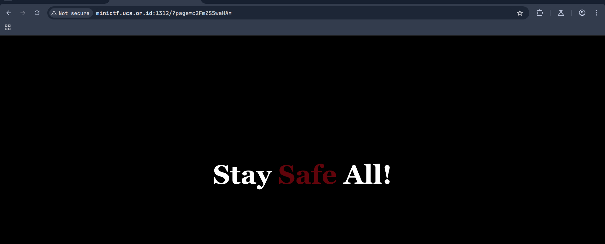

# ACAB
### Description: ACAB!!!!!!!!!! this shit is going crazyyy!!

We are given a link to a website:
```
http://minictf.ucs.or.id:1312/
```

Accessing the website, we can see two buttons telling us unrelated informations:


### Pressing [What?]


### Pressing [Stay Safe]


However, i noticed that the ```?page=``` argument was written in what seems to be a Base64 encoded message, such as ```c2FmZS5waHA=``` and ```YWJvdXQucGhw```. Translating this yields about.php and safe.php.

Since there are no buttons that allow you to make a POST request anywhere on the website, and inspect element doesn't show anything of substance as well, i will have to guess that this challenge is an LFI Attack (Local File Inclusion).

LFI works by tricking the web application into exposing files or running something that the owner does not want to be seen by traversing the directory of the website.

To solve, we first need to reach root. For this, i'm gonna append a bunch of ```../../../../../../```'s to the ```?page=``` argument. However, we need to encode it into Base64 beforehand:

```Li4vLi4vLi4vLi4vLi4vLi4vLi4vLi4vLi4vLi4vLi4vLi4vLi4vLi4vLi4vLi4vLi4vLi4vLi4vLi4vLi4v```


Afterwards, i remembered from solving ctflearn.com challenges that there exists a robots.txt after the root dir, but since we are looking for flags, i assumed the .txt is possibly named ucs or flag.

ucs doesn't work, so i appended the Base64 of ```flag.txt``` into the earlier ```../../../../```:

```
Li4vLi4vLi4vLi4vLi4vLi4vLi4vLi4vLi4vLi4vLi4vLi4vLi4vLi4vLi4vLi4vLi4vLi4vLi4vLi4vZmxhZy50eHQ=
```

Appending flag.txt was the correct one instead of ucs, therefore the flag is ours now.


Flag: ```UCS{ACAB!!!_pr4y_f0r_0ur_c0untry_Th1s_sH1t_Happened_1s_G0ing_Crazy!!}```
