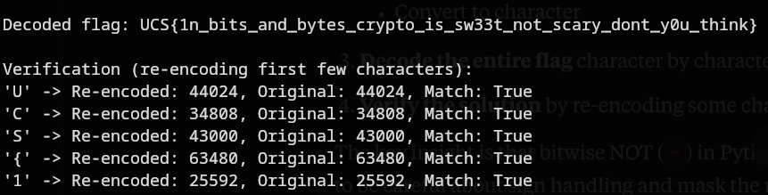

# Bittersweet
### Description: Not all secrets taste the same... some are sweet, others a little bitter. Decode this one and see what flavor of truth it holds.

We are given a python file called ```chall.py```:

```
flag='FLAG'
out = []
for i in flag:
	out.append(str((~ord(i)<<9)^~7))

print(out)
# ['44024', '34808', '43000', '63480', '25592', '56824', '49144', '50680', '54264', '59896', '59384', '49144', '50168', '56824', '51704', '49144', '50680', '62456', '59896', '52216', '59384', '49144', '51192', '58872', '62456', '57848', '59896', '57336', '49144', '54264', '59384', '49144', '59384', '61432', '26616', '26616', '59896', '49144', '56824', '57336', '59896', '49144', '59384', '51192', '50168', '58872', '62456', '49144', '51704', '57336', '56824', '59896', '49144', '62456', '25080', '60408', '49144', '59896', '53752', '54264', '56824', '55288', '64504']
```
Let's break down the encoding operation:
```
str((~ord(i)<<9)^~7)
```
```ord(i)``` - get ASCII value of character,

```~ord(i)``` - bitwise NOT of ASCII value,

```~ord(i)<<9``` - left shift by 9 bits,

```(~ord(i)<<9)^~7``` - XOR with bitwise NOT of 7 (which is -8 in two's complement),

Convert to string.

To get the flag, we must reverse the operations. Since the CTF Competition is time sensitive, i told Claude to give me the code to help with that by explaining my logic: converting the strings to integer, XOR with ~7 (-8), right shift by 9 bits, applying bitwise NOT, mask to 8 bits to get the proper ASCII values, and then convert to character.

Afterwards, the solver will decode the flag character by character and perform a check by re-encoding some characters to see if they match.

Here is the solver:
```
# Given encoded output
out = ['44024', '34808', '43000', '63480', '25592', '56824', '49144', '50680', '54264', '59896', '59384', '49144', '50168', '56824', '51704', '49144', '50680', '62456', '59896', '52216', '59384', '49144', '51192', '58872', '62456', '57848', '59896', '57336', '49144', '54264', '59384', '49144', '59384', '61432', '26616', '26616', '59896', '49144', '56824', '57336', '59896', '49144', '59384', '51192', '50168', '58872', '62456', '49144', '51704', '57336', '56824', '59896', '49144', '62456', '25080', '60408', '49144', '59896', '53752', '54264', '56824', '55288', '64504']

# Let's trace through the encoding process first to understand it
print("Understanding the encoding:")
test_char = 'F'  # First character of FLAG
print(f"Original char: '{test_char}' (ASCII: {ord(test_char)})")
print(f"~ord('{test_char}') = ~{ord(test_char)} = {~ord(test_char)}")
print(f"~ord('{test_char}') << 9 = {~ord(test_char) << 9}")
print(f"~7 = {~7}")
print(f"Final result: {(~ord(test_char) << 9) ^ ~7}")
print()

# Now let's reverse the process
def reverse_encode(encoded_str):
    # Convert string to int
    encoded_val = int(encoded_str)
    
    # Reverse: XOR with ~7
    after_xor = encoded_val ^ ~7
    
    # Reverse: Right shift by 9
    after_shift = after_xor >> 9
    
    # Reverse: Apply bitwise NOT
    original_ascii = ~after_shift
    
    # Handle potential negative values due to two's complement
    # In Python, we need to mask to get the proper ASCII value
    original_ascii = original_ascii & 0xFF
    
    return chr(original_ascii)

# Decode the flag
flag = ""
for encoded_char in out:
    decoded_char = reverse_encode(encoded_char)
    flag += decoded_char
    print(f"Encoded: {encoded_char} -> Decoded: '{decoded_char}' (ASCII: {ord(decoded_char)})")

print(f"\nDecoded flag: {flag}")

# Let's verify our decoding by re-encoding the first few characters
print("\nVerification (re-encoding first few characters):")
for i, char in enumerate(flag[:5]):
    re_encoded = str((~ord(char) << 9) ^ ~7)
    original_encoded = out[i]
    print(f"'{char}' -> Re-encoded: {re_encoded}, Original: {original_encoded}, Match: {re_encoded == original_encoded}")
```

Running the solver above gave us the flag.


Flag: ```UCS{1n_bits_and_bytes_crypto_is_sw33t_not_scary_dont_y0u_think}```