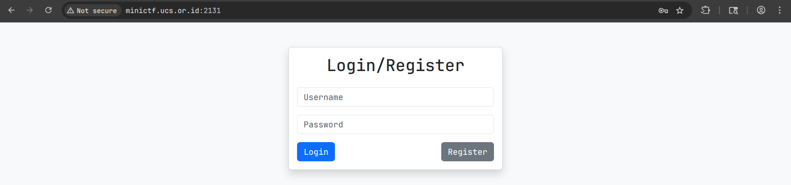
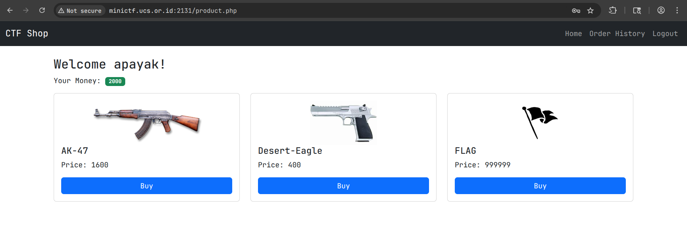
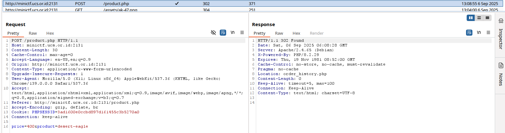
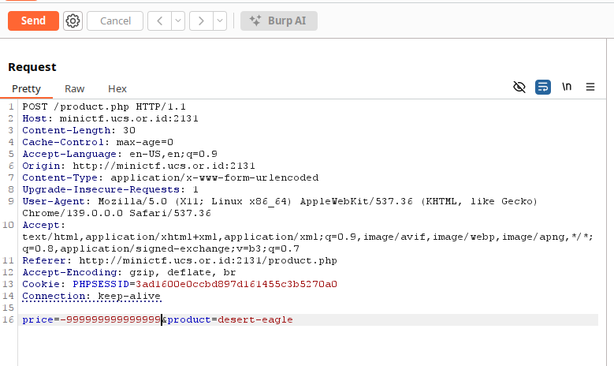
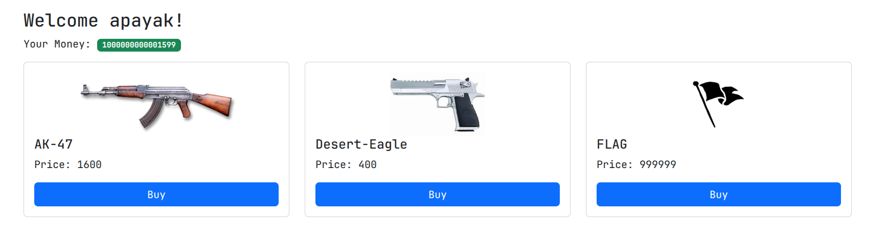
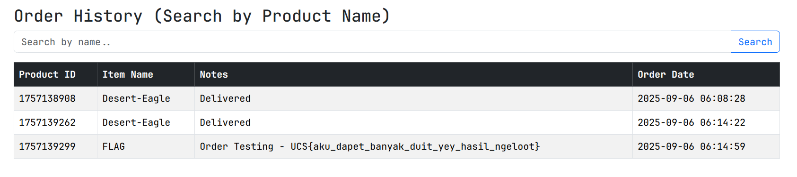

# MinusLogika 
### Description: ga abis pikir itu dimana logikanya, sampe ikutan rusak Final Projectku. Nih kukasih buat lawan

We are given a link to a website with (presumably) vulnerability to exploit:
```
http://minictf.ucs.or.id:2131/
```
For this challenge i decided to boot up BurpSuite since i have severe skill issue using curl and to make it easier on the eye.



I made an account and went on to the next step, accessing the actual website:



As we can see, we have ```2000``` in cash, and to buy the flag we need an exorbitant amount. This, coupled with the challenge name, implies we must earn the money by making a POST request with edge-case input arguments.

First of all, i do not know the exact parameters of money/cash, and with the initial money, i bought a desert-eagle and used BurpSuite to intercept the POST request made:



```price=400&product=desert-eagle``` is especially valuable info to get.

I then forwarded this request to the Repeater, and edited ```400``` to obscenely massive negative value to make myself richer than DPR politicians: 



When this request is sent to the website, the negative value effectively flips over to positive into our account because we are trying to "expend" negatives (-(-)). Therefore we get the sum next to the - symbol instead of expending that amount.



Since i'm rich now i can buy the flag immediately:


Flag: ```UCS{aku_dapet_banyak_duit_yey_hasil_ngeloot}```