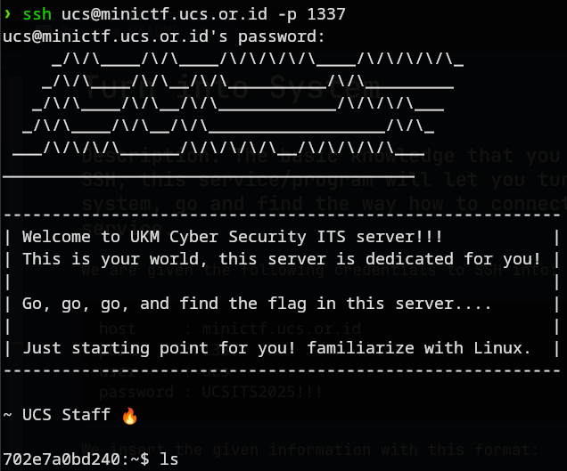
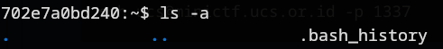

# Turn into System
### Description: The basic knowledge that you must be know is SSH, this service/program will let you turn into the server system, go and find the way how to connect with SSH service.

We are given the following credentials to SSH into:
```
host     : minictf.ucs.or.id
port     : 1337
user     : ucs
password : UCSITS2025!!!
```
We insert the given information with this format:
```
ssh ucs@minictf.ucs.or.id -p 1337  
```
After inserting the given password when prompted, this appeared on screen:



We may proceed to explore the shell by doing ls, but nothing turned up, so i added the "-a" (stands for "all") flag, (ls -a) and a hidden file (indicated by the dot at the beginning of the name) showed up 


Now lets open it using "cat .bash_history" to see what's inside:
```
ls
pwd
whoami; id; hostname; pwd
ls -al
ls -al ~
find ~ -maxdepth 3 -type f -iname 'flag*' -print -exec cat {} \; 2>/dev/null
grep -R --text -n 'UCS{' ~ 2>/dev/null
which doas || which sudo
doas -C /etc/doas.d/doas.conf 2>/dev/null || doas -C /etc/doas.conf 2>/dev/null
doas -s
ls -la /root
cat /root/flag* 2>/dev/null || cat /flag* 2>/dev/null
ls -la /root
cat /root/flag* 2>/dev/null || cat /flag* 2>/dev/null
ls -la /root
cat /root/flag* 2>/dev/null || cat /flag* 2>/dev/null
ls -la /root
cat /root/flag* 2>/dev/null || cat /flag* 2>/dev/null
ls -la /root
cat /root/flag* 2>/dev/null || cat /flag* 2>/dev/null
ls -al /
ls -al /{opt,srv,var,var/www,var/www/html,usr/local,usr/share/nginx/html,usr/share/webapps,app,apps,data,mnt,media,tmp} 2>/dev/null
find / -maxdepth 3 -type d -iname '*flag*' -perm -o+rx   -not -path '/proc/*' -not -path '/sys/*' 2>/dev/null -print
find / -maxdepth 4 -type f -iname 'flag*' -perm -o+r   -not -path '/proc/*' -not -path '/sys/*' 2>/dev/null   -exec sh -c 'echo "== {} =="; head -n 5 "{}"' \;
cat /44e3a5417e3307caeb347abdf02b1915_flag.txt
ls
ls
cat flag
ls -la
cd /
ls
find / -name "flag" 2>/dev/null
cd
cd ucs
cd /
cat 44e3a5417e3307caeb347abdf02b1915_flag.txt 
~.
cd
ls
cd ..
cd ..
ls
cat 44e3a5417e3307caeb347abdf02b1915_flag.txt
cd home
ls
cd ucs
ls
clear
exit
ls -la
cat README.txt
find / -name "*flag*" 2>/dev/null
find ~ -iname "*flag*"
sudo find / -iname "*flag*" 2>/dev/null
ls -la ~
ls -la /home
ls -la /root
ls -la /tmp
grep -r "flag" ~
cat nama_file
find ~ -iname "*flag*"
cat ~/flag.txt
cat / 44e3a5417e3307caeb347abdf02b1915_flag.txt
cat /44e3a5417e3307caeb347abdf02b1915_flag.txt
```
The last entry looks like the answer to this challenge, so i copied the command, and pasted it to get the flag.

Flag: ```UCS{SSH_IS_th3_1mport4nt_c0mmand_program_th4t_You_should_kn0w!!!!}```
