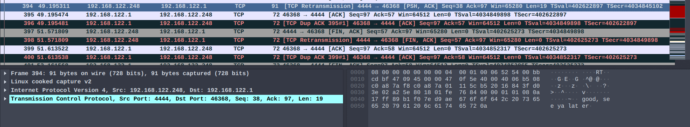
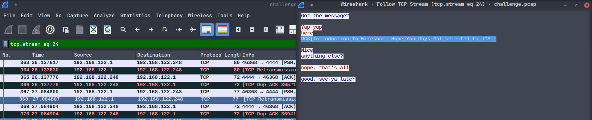

# Wiring
### Description: Udah pada tau wireshark tentunya tau beberapa fitur yang ada lah ya hehe...

We are given a Packet capture file named ```challenge.pcap``` that we can analyze with Wireshark.

I found this specific package that has some strings inside it:


By following the TCP Stream of that packet, the flag is obtained.


Flag: ```UCS{Introduction_To_Wireshark_Hope_You_Guys_Got_selected_to_UCS!}```