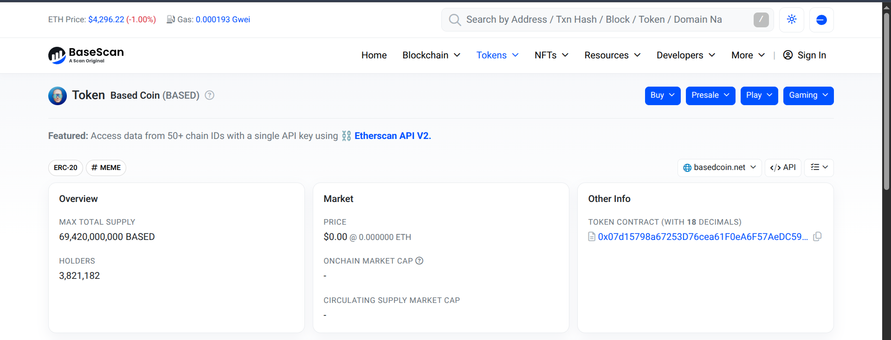
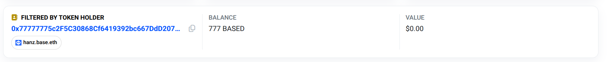

# balance
### Description: How many BASED tokens did I have? My address: 0x77777775c2F5C30868Cf6419392bc667DdD207EC Token address: 0x07d15798a67253D76cea61F0eA6F57AeDC59DffB Network: Base (https://basescan.org) Flag format: UCS{balanceinether}

We are given those addresses to search at basescan.org.

First i looked up the coin in question (BASED):


Scrolling down, there is an option to search transfers by address, so i put in the given address:


As we can see, the BALANCE indicate 777, therefore the flag is found.

Flag: ```UCS{777}```