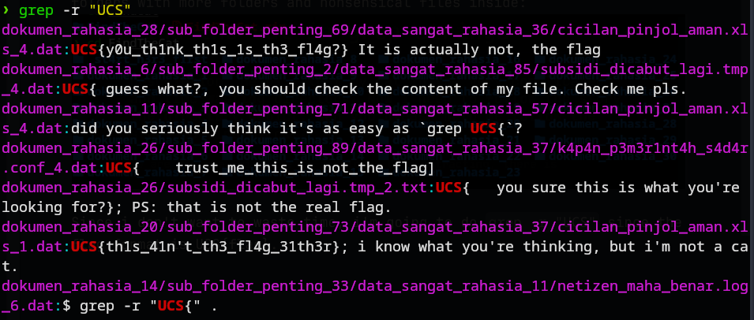
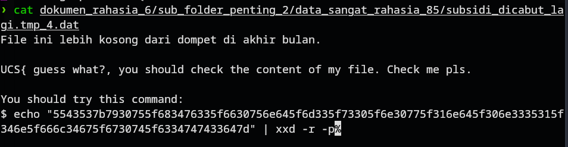

# find the cat in grep strings
### Description: Help! I lost my cat in the very complicated and time-wasting directory. Now I need to follow the story the directory depict. Can you please help me follow the story to find my cat?

We are given a .zip file to download. Upon extracting, there is a bunch of folders with more folders and nonsensical files inside:


Since i don't want to waste time, i'm going to do ``` grep -r "UCS"``` since the flag format is UCS{flag}. the -r flag here mean "recursive" so grep tries to find the specified string (in this case UCS) in every directory contained inside the directory where the command was executed.



One of the fake flags seems to suggest that the content of the .txt file it is located on may have the answer we seek ```(UCS{ guess what?, you should check the content of my file. Check me pls.})```

So i copied the file path, and ran cat on it:


Interesting, running the command given prints the flag.

Flag: ```UCS{y0u_h4v3_f0und_m3_s0_n0w_1nd_0n351_4n_fl4g_g0t_c4tt3d}```
