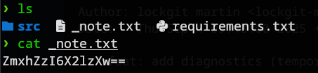

# lockgit martin 
### Description: this logbook holds whispers of a secret council. can you piece them back together?

We are given a .zip file. Upon extraction, there is a directory connected to git:


Usually if a directory has git initialized, there is more than meets the eye, since git allows "saving" and "rolling back" periods that may have different states of the working directory (more files, changes, etc.)

To explore, we can run the command git log --all (the --all) flag here is to make it absolutely sure that we didn't miss anything. 
```
commit 77b7667aa85d13252a00950d3a560ffb9824c9fa (HEAD -> main)
Author: lockgit martin <lockgit-martin@example.local>
Date:   Thu Sep 4 09:48:00 2025 +0700

    chore: disable recon route

commit bb253f6c64a794aac52e8ac55e35a6ec223f7f28 (refs/stash)
Merge: 438b592 8cd1b41
Author: lockgit martin <lockgit-martin@example.local>
Date:   Thu Sep 4 09:48:00 2025 +0700

    On main: wip: write note

commit 04e04f12cba75fed0c674341a60d8e3a381c33ad
Author: lockgit martin <lockgit-martin@example.local>
Date:   Thu Sep 4 09:48:00 2025 +0700

    feat: add recon route (temporary)

commit 438b592546e9095bc8f5c3ff983a0c387b42ca87
Author: lockgit martin <lockgit-martin@example.local>
Date:   Thu Sep 4 09:48:00 2025 +0700

    cleanup: remove diagnostics

commit 8cd1b41ec9fa351929f1f62ac1c12a79e927d401
Author: lockgit martin <lockgit-martin@example.local>
Date:   Thu Sep 4 09:48:00 2025 +0700

    index on main: 438b592 cleanup: remove diagnostics

commit 72d00fa976be9312f5354c631490e9e5a4cc6fd7
Author: lockgit martin <lockgit-martin@example.local>
Date:   Thu Sep 4 09:48:00 2025 +0700

    feat: add diagnostics (temporary)

commit 5eaf8e61728be1c5bc68fea8b6b741e7b329e0df
Author: lockgit martin <lockgit-martin@example.local>
Date:   Thu Sep 4 09:48:00 2025 +0700

    init: scaffold minimal flask app
```

These commit histories has many changes going on with them. For now, i'm saving the list on notepad. The numbers next to commit (like bb253f6c64a794aac52e8ac55e35a6ec223f7f28) is called a commit hash, which is a unique identifier for commit actions to reference.

I'm going to start exploring the second commit hash from the top:
```git checkout bb253f6c64a794aac52e8ac55e35a6ec223f7f28```

There is a new file named _note.txt, so i catted it:


The given Base64 when decrypted writes: ```flag2:_is_```
Interesting, this seems like a multi-parted flag, a common method to increase difficulty in CTF challenges. 

Now i'm going through the third hash: ```git checkout 04e04f12cba75fed0c674341a60d8e3a381c33ad```


This image looks like a potential clue, so i opened it:


It turned out to be a joke from the challenge author.

Next, i went to "src" folder, and opened to see what was inside the python file:


The "hx" variable lists a bunch of numbers and letters. It looked like Hexadecimals, so i decoded it in Cyberchef to get the next flag piece: ```flag3:fun_isnt_it}```

Now we are missing the last flag which is ironically the first piece. To find it, lets explore the other hashes:

```git checkout 438b592546e9095bc8f5c3ff983a0c387b42ca87``` but this one doesn't have any glaring clues/changes to it. 

```git checkout 72d00fa976be9312f5354c631490e9e5a4cc6fd7``` 

This one has a new .txt file, and when opened gives us the last flag piece: 


Flag: ```UCS{multipart_is_fun_isnt_it}```
