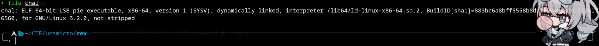
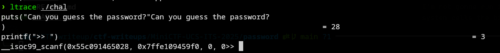
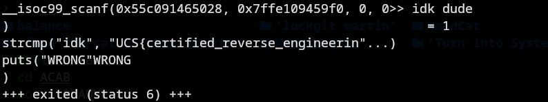
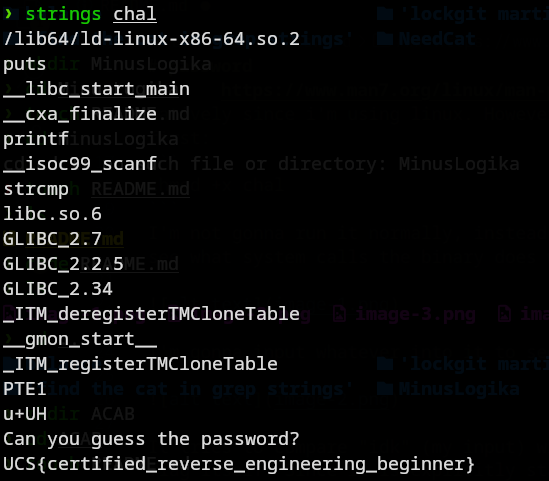

# password
### Description: Did you know the password? Resources:

###    https://dogbolt.org/
###    https://hex-rays.com/ida-pro
###    https://binary.ninja/
###    https://www.nsa.gov/ghidra
###    https://en.wikipedia.org/wiki/Ptrace
###    https://www.man7.org/linux/man-pages/man1/strings.1.html

In this challenge, we are given a binary named ```chal```. 

First let's identify what type of binary it is:


It's an ELF 64-bit executable for linux, so we can just run it natively since i'm using linux. However, let's give it permissions first:
```
chmod +x chal
```
I'm not gonna run it normally, instead i'm gonna use ```ltrace``` to see what system calls the binary does when interacted with:



I'm gonna input whatever into it to see what'll happen:



It tries to compare "idk" (my input) with what looks like the actual flag itself. Since it is explicitly stated as a call, it's not referencing any memory location so using ```strings``` on the binary will print out any string inside it:



And we found the flag.

Flag: ```UCS{certified_reverse_engineering_beginner}```
