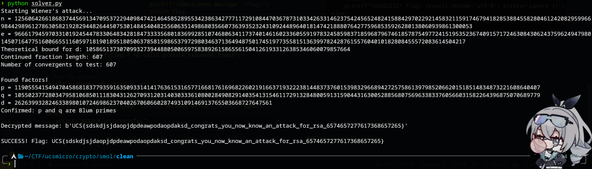

# smol 
### Description: the params seems to be a bit weird... as long as it works i guess :shrug:

We are given a python file called ```chall.py``` and a text file ```output.txt```.

chall.py:
```
from Crypto.Util.number import *
import random

with open('flag.txt','rb') as f:
    m = bytes_to_long(f.read().strip())

def blum_prime(bits=512):
    while True:
        p = getPrime(bits)
        if p % 4 == 3:
            return p

p = blum_prime(512)
q = blum_prime(512)
n = p * q

phi = (p - 1) * (q - 1)

bound = max(3, int(n**0.25) // 8) 
while True:
    d = random.randint(2, bound)
    if GCD(d, phi) == 1:
        break

e = inverse(d, phi)
c = pow(m, e, n)

with open('output.txt','w') as f:
    f.write(f"{n}\n{e}\n{c}\n")
```
output.txt:
```
125606426618683744569134709537229409847421464585289553423863427771172910844703678731033426331462375424565248241588429702292145832115917467941828538845582804612420829599669844298961278630582192829448264450753014845404825560635149868035660736393523243109244896401814742188807642775968535926280138060939861300053
9666179459703310192454478330648342818473333568018369928510746806341173740146160233605591978324585983718596879674618578754977241519535236740915717246308430624375962494798014507164775160066551160597181901895180506378581598653797298034637136494875017451977355815136399782428761557604010182808455572083614504217
124045709172602859974825506757868289698407617368632021329766203716320682339272589456269815078366199000220066385164852368854230554411375867857159899501209562482703211032858112555616553894272985581207080354617735890010955081724521533973397203370681556701583664727047736082782678231976706744897069101960518231354
```
To give a quick analysis, i forwarded both entries to Claude, which reveals that this is a RSA Cryptosystem with vulnerability to Wiener's attack because the variable "d" is only bounded to n^0.25 / 8, which is very small.

Using this generated code, the flag is then recovered:
```
from Crypto.Util.number import *
import math
from fractions import Fraction

def isqrt(n):
    """Integer square root using Newton's method"""
    if n < 0:
        raise ValueError("Square root of negative number")
    if n < 2:
        return n
    
    # Initial guess
    x = n
    while True:
        y = (x + n // x) // 2
        if y >= x:
            return x
        x = y

# Given values from output.txt
n = 125606426618683744569134709537229409847421464585289553423863427771172910844703678731033426331462375424565248241588429702292145832115917467941828538845582804612420829599669844298961278630582192829448264450753014845404825560635149868035660736393523243109244896401814742188807642775968535926280138060939861300053
e = 9666179459703310192454478330648342818473333568018369928510746806341173740146160233605591978324585983718596879674618578754977241519535236740915717246308430624375962494798014507164775160066551160597181901895180506378581598653797298034637136494875017451977355815136399782428761557604010182808455572083614504217
c = 124045709172602859974825506757868289698407617368632021329766203716320682339272589456269815078366199000220066385164852368854230554411375867857159899501209562482703211032858112555616553894272985581207080354617735890010955081724521533973397203370681556701583664727047736082782678231976706744897069101960518231354

def continued_fraction(e, n):
    """Generate continued fraction expansion of e/n"""
    cf = []
    while n != 0:
        cf.append(e // n)
        e, n = n, e % n
    return cf

def convergents(cf):
    """Generate convergents from continued fraction"""
    convergents_list = []
    if len(cf) == 0:
        return convergents_list
    
    h_prev, h_curr = 0, 1
    k_prev, k_curr = 1, 0
    
    for i in range(len(cf)):
        h_new = cf[i] * h_curr + h_prev
        k_new = cf[i] * k_curr + k_prev
        convergents_list.append((h_new, k_new))
        h_prev, h_curr = h_curr, h_new
        k_prev, k_curr = k_curr, k_new
    
    return convergents_list

def wiener_attack(e, n, c):
    """
    Wiener's attack on RSA with small private exponent d
    """
    print(f"Starting Wiener's attack...")
    print(f"n = {n}")
    print(f"e = {e}")
    print(f"Theoretical bound for d: {int(n**0.25)}")
    
    # Generate continued fraction of e/n
    cf = continued_fraction(e, n)
    print(f"Continued fraction length: {len(cf)}")
    
    # Generate convergents
    convs = convergents(cf)
    print(f"Number of convergents to test: {len(convs)}")
    
    for i, (k, d) in enumerate(convs):
        if k == 0 or d <= 0:
            continue
            
        # Check if k/d is a valid approximation
        if d > int(n**0.25):  # d should be small
            continue
            
        # For RSA: ed ≡ 1 (mod φ(n))
        # So ed - 1 = k * φ(n) for some integer k
        # We know φ(n) = n - p - q + 1, and for Blum integers p*q where p≡q≡3(mod 4)
        
        if (e * d - 1) % k == 0:
            phi_candidate = (e * d - 1) // k
            
            # Check if this phi gives us integer solutions for p and q
            # We have: p + q = n - phi_candidate + 1
            # And: p * q = n
            # So we solve: x^2 - (sum)x + product = 0
            
            sum_pq = n - phi_candidate + 1
            discriminant = sum_pq * sum_pq - 4 * n
            
            if discriminant >= 0:
                sqrt_discriminant = isqrt(discriminant)
                if sqrt_discriminant * sqrt_discriminant == discriminant:
                    p = (sum_pq + sqrt_discriminant) // 2
                    q = (sum_pq - sqrt_discriminant) // 2
                    
                    if p > 0 and q > 0 and p * q == n:
                        print(f"\nFound factors!")
                        print(f"p = {p}")
                        print(f"q = {q}")
                        print(f"d = {d}")
                        
                        # Verify p and q are Blum primes (≡ 3 mod 4)
                        if p % 4 == 3 and q % 4 == 3:
                            print("Confirmed: p and q are Blum primes")
                            
                            # Decrypt the message
                            try:
                                m = pow(c, d, n)
                                flag = long_to_bytes(m)
                                print(f"\nDecrypted message: {flag}")
                                return flag
                            except Exception as ex:
                                print(f"Decryption failed: {ex}")
                        else:
                            print("Warning: p and q are not Blum primes")
    
    print("Attack failed - no valid private exponent found")
    return None

# Run the attack
result = wiener_attack(e, n, c)

if result:
    print(f"\nSUCCESS! Flag: {result.decode('utf-8', errors='ignore')}")
else:
    print("Attack unsuccessful")
```


Flag: ```UCS{sdskdjsjdaopjdpdeawpodaopdaksd_congrats_you_now_know_an_attack_for_rsa_6574657277617368657265}```