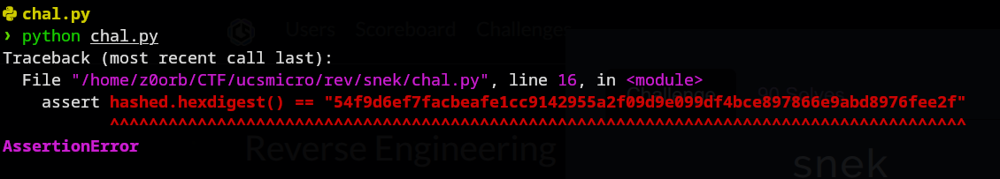
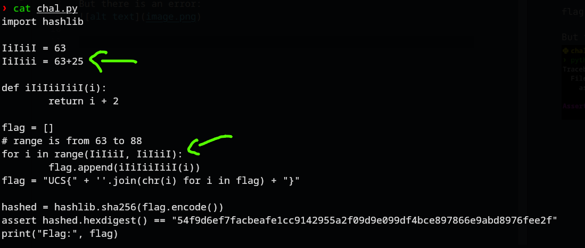
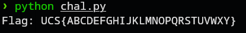

# snek
### Description: Python is an easy language

In this challenge, we are give a python file to download.

Opening the python file, looks like the flag needs a Hash check of SHA256 to be able to print out the content. The hash to check and print out the flag is already there, so it should solve immediately.

But there is an error:


Turns out, after looking into the source code, the for loop is supposed to to in range of 65 (63+2) to 88 (89 in effect). However, the actual argument of the upper boundary is NOT the variable where 63+25 (88) is declared, (insted of ```IiIiii```, it is ```IiIiiI```). Notice how the final I is not lowercase.


Editing it to lowercase, fixed the error and now the flag will print out:


Also fun fact, the values between 65-89 is the ASCII value of A-Y (which is appended next to one another forming the flag).

Flag: ```UCS{ABCDEFGHIJKLMNOPQRSTUVWXY}```