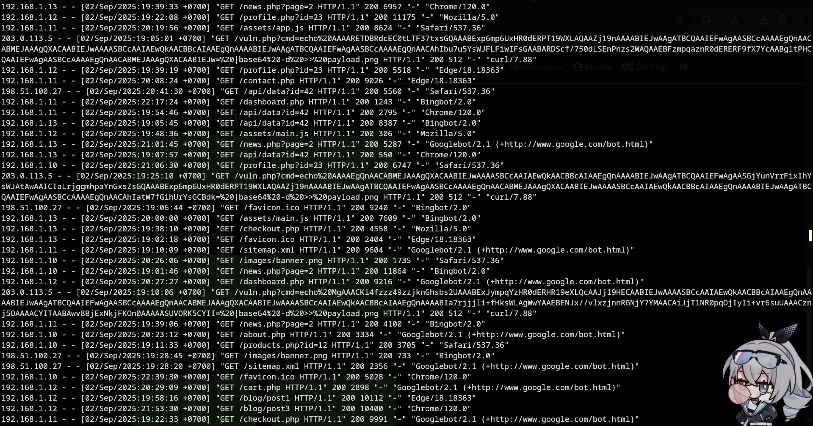
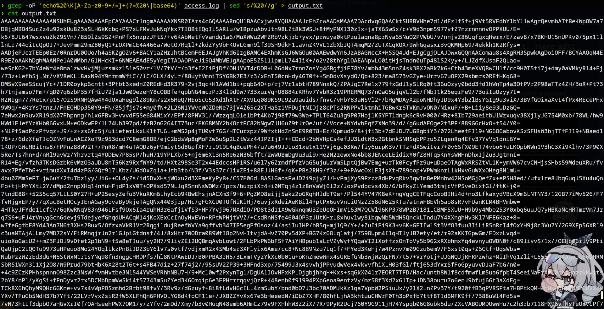
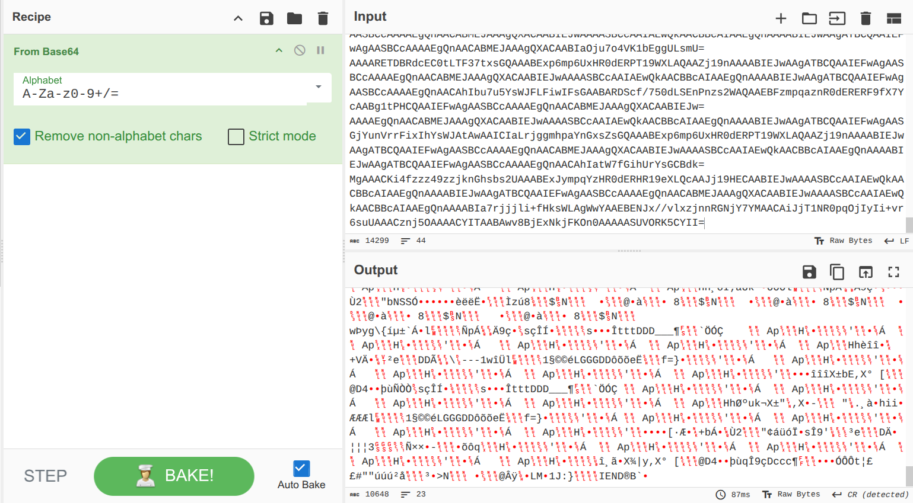
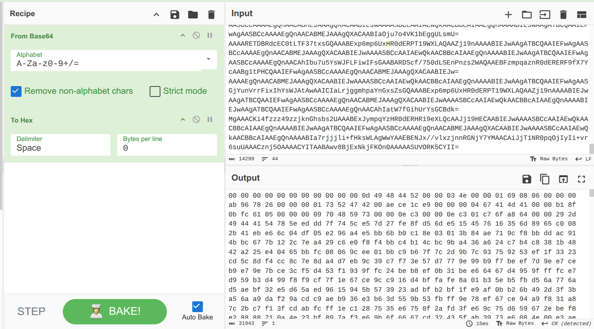
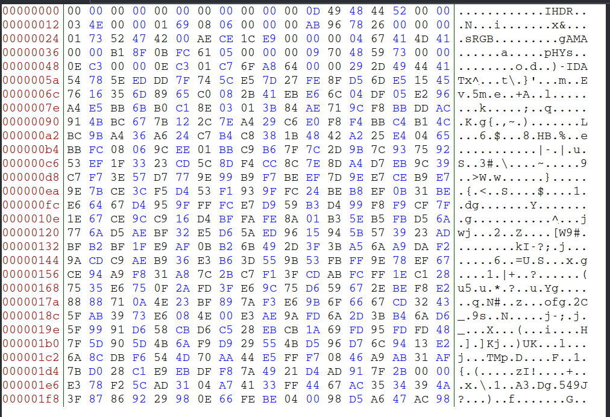
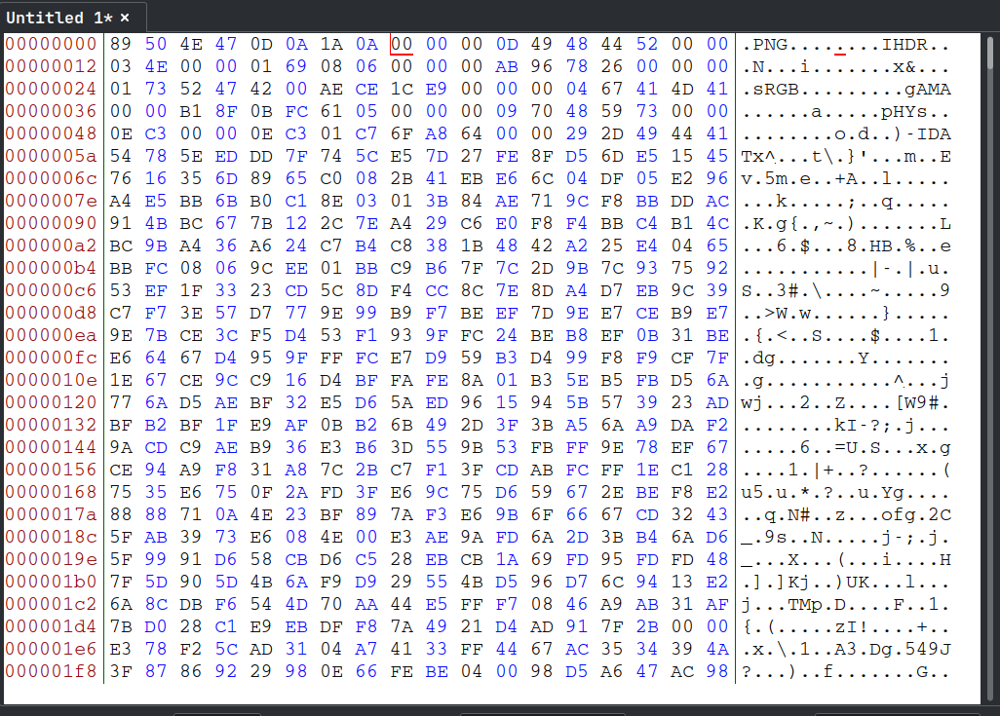

# vitaminA
### Description: if u see something sus, analyze it. There will be something even stranger.

We are given a .log file named ```access.log```.

Opening the log prints out a massive stream of data indicating GET requests to a website and a lot of interspersed Base64 encoded messages.


I'm not gonna manually copy and paste each one so i'm gonna do grep with regex and pipe it into a .txt file for easy copying since clock's ticking.

```
grep -oP 'echo%20\K[A-Za-z0-9+/=]+(?=%20\|base64)' access.log | sed 's/%20//g' > output.txt
```



Much better, now i copy all of it and pasted it into CyberChef to decode:


It sputtered out what looks like nonsense until you see ```IENDB```
at the end, which indicates that these stream of data is possibly PNG Hexes.

Then i added To Hex in CyberChef, and copied the result over to a Hex Editor:




A PNG file has a header, and this one seems to be missing. PNG's header is on the first 8 bytes of the beginning of the file, that is:
```
89 50 4E 47 0D 0A 1A 0A
```


Now with it appended, i saved the file as a .png, and opened it:


Flag: ```UCS{log_analysis_and_file_image_recovery}```
