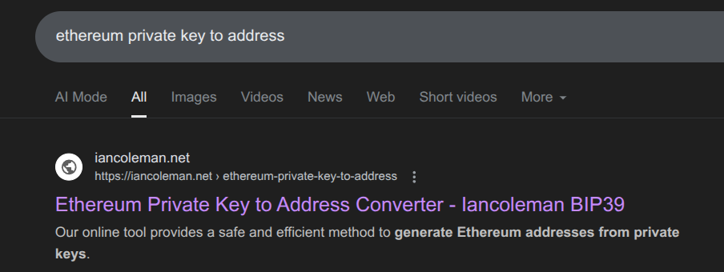
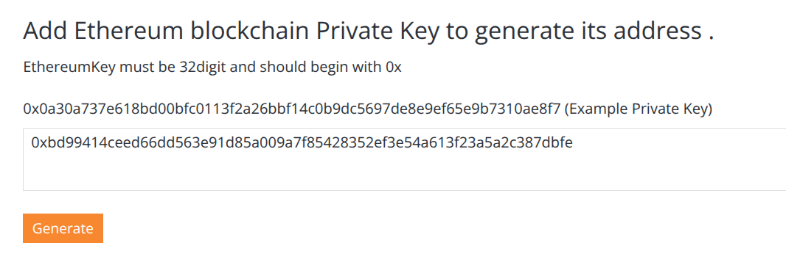
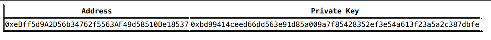
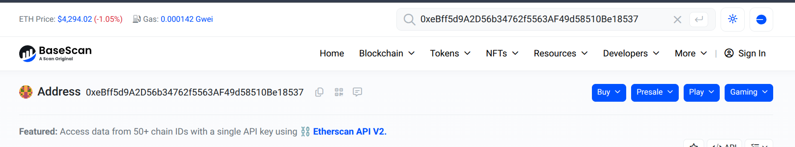

# wallet
### Description: Derive the wallet address of this Ethereum private key: 0xbd99414ceed66dd563e91d85a009a7f85428352ef3e54a613f23a5a2c387dbfe 

### Flag format: UCS{addresshere}


Now, i know, the intended way to solve this involves some mathematical skills and creating a script to generate the public address. But as it turns out there are online tools to solve it so i'm gonna use that since time is of the essence in CTF competitions:


I punched in the private key to the machine and let it do it's thing:


And we got the public address (left) from the given private key (right):


Went back to basescan.org from the "balance" challenge and sure enough the wallet exists:


Flag: ```UCS{0xeBff5d9A2D56b34762f5563AF49d58510Be18537}```